## Pflichtenheft

### Allgemeine Beschreibung des Projekts

Community-Plattform für Computerspiele

### Navigationsleiste
Die Navigationsleiste ist allen anderen Funktionen übergeordnet, wird oben auf jeder Seite angezeigt. Sie wird also über jedem Objekt dargestellt.
Sie beinhaltet die wichtigsten Verweise. Ein Verweis auf die Registrierung, Anmeldung oder Abmeldung.
Ihr Inhalt der Navigationsleiste lautet wie folgt:
* Logo der Plattform (Verweis auf die Startseite)
* Terminplaner
* Spielebibliothek
* Gruppen/Freunde (Community)
* Registrierung und Anmeldung oder Abmeldung
#### Mockups Navigationsleiste

### Registrierung
Jede Person kann sich registrieren, egal ob über die Web-Anwendung, Desktop-Anwendung oder Mobile-Anwendung.
Für die Registration muss man einen noch nicht vergebenen Benutzernamen, eine noch nicht verwendete E-Mail und ein Passwort angeben.
Das Passwort muss wiederholt werden um Schreibfehler vorzubeugen.
#### Mockups Registrierung
  

### Anmeldung
Jede Person die sich erfolgreich registriert hat, kann sich anmelden.
Um sich anzumelden, muss eine korrekte Eingabe von Benutzername und Passwort getätigt werden.
#### Mockups  Anmeldung
 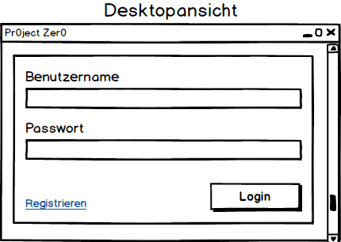 

### User-Story: Registrierung und Anmeldung
In einer Internet-Vertriebsplattform für Computerspiele möchte ich mich möglichst unkompliziert mit meinem
Benutzernamen/Email und Passwort regestrieren und einloggen können.
Beim Anlegen neuer Nutzer muss ein Benutzername, eine Email und ein Passwort angegeben werden.

| Rolle        | möchte ich...                            | so dass...                               | Akzeptanz                                | Priorität |
| ------------ | ---------------------------------------- | ---------------------------------------- | ---------------------------------------- | --------- |
| Als Benutzer | mich registrieren können                 | ich mit anmelden kann                    | Bei der Registrierung muss ein Benutzername, eine Email-Adresse und ein Passwort angegeben worden sein | MUSS      |
| Als Benutzer | mich mit meinem Benutzernamen ODER Email anmelden können | ich meine Nutzerfunktionen ausschöpfen kann | Bei der Anmeldung muss entweder der Benutzername oder die Email angegeben werden. Zusätzlich muss das entsprechende Passwort eingegeben werden | MUSS      |
| Als Benutzer | mein Passwort bei der Registrierung wiederholt eingeben | ich bei einem möglichen Tippfehler kein "falsches" Passwort erstelle | Das Passwort wird bei der Registrierung in zwei Textfeldern wiederholt eingegeben | MUSS      |
| Als Benutzer | mein Passwort zurücksetzen können        | ich mein "verlorenes" Passwort und somit meinen Zugriff auf mein Konto wieder bekommen kann | Durch ein Klick auf den "Passwort-vergessen" Button kann man mit Hilfe einer "Reaktivierungs"-Email das entsprechende Passwort zurücksetzen lassen; vorausgesetzt die angegebene Email-Adresse besitzt ein bereits erstelltes Konto | SOLL      |
| Als Benutzer | mein Benutzernamen "nachfragen" können   | ich mein "verlorenen" Benutzernamen und somit meinen Zugriff auf mein Konto wieder bekommen kann | Durch ein Klick auf den "Benutzernamen-vergessen" Button kann man mit Hilfe der Email-Adresse den Benutzernamen an die angegebene Email senden; vorausgesetzt die angegebene Email-Adresse besitzt ein bereits erstelltes Konto | SOLL      |
| Als Benutzer | meine persönlichen Daten wie z.B. Adresse, Stadt etc. bei der Registrierung angeben | man mich einfacher identifizieren kann   | Bei der Registrierung gibt es Textfelder zu persönlichen Daten wie z.B. Adresse, Stadt etc. die ausgefüllt werden können und im Profil ersichtlich sind | KANN      |

### Usecase: Registrierung und Anmeldung

### Spielebibliothek
In der Spielebibliothek werden alle verfügbaren (gekauften) Spiele angezeigt.
Diese können dann aus der Spielebibliothek gestartet werden.
Spiele können über ein Menü der Bibliothek hinzugefügt werden. Für jedes Spiel wird eine Beschreibung,
eine Bewertung und die Benutzer angezeigt, welche im Moment dieses Spiel spielen und somit auch besitzen müssen.
#### Mockups Spielebibliothek
 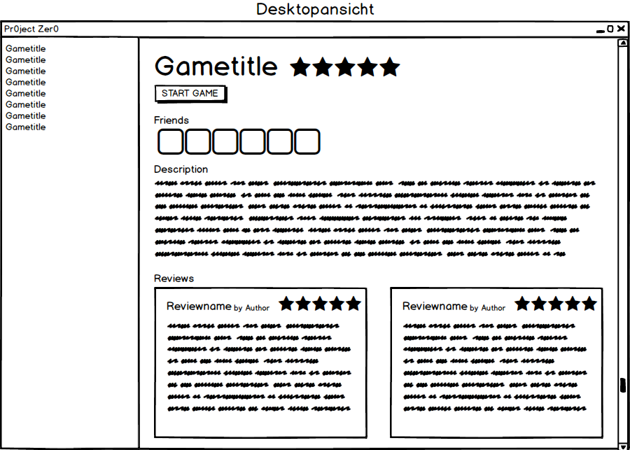

#### User-Stories

| Rolle        | In meiner Rolle möchte ich               | so dass                                  | Akzeptanz                                | Priorität |
| ------------ | ---------------------------------------- | ---------------------------------------- | ---------------------------------------- | --------- |
| Als Benutzer | meine gekauften Spiele sehen             | ich auf einen Blick sehe welche Spiele ich besitze | In der Spielebibliothek werden 0-n gekaufte Spiele angezeigt. | Muss      |
| Als Benutzer | meine Spiele auswählen                   | ich erweiterte Informationen zum Spiel bekomme | Bei Auswahl eines Spiels wird eine erweiterte Ansicht angezeigt | Muss      |
| Als Benutzer | meine Spiele starten                     | ich meine Spiele spielen kann            | Startbutton wird in der erweiterten Ansicht angezeigt | Muss      |
| Als Benutzer | gekaufte Spiele einlösen                 | ich sie meiner Bibliothek hinzuzufügen   | es einen Menüpunkt gibt, mit dem man Spiele aktivieren kann | Muss      |
| Als Benutzer | wissen wer das aktuell ausgewählte Spiel spielt | ich das Spiel gemeinsam mit Freunden spielen kann | bei jedem Spiel werden 0-n Freunde angezeigt, die das Spiel aktuell spielen | Soll      |
| Als Benutzer | die Beschreibung lesen                   | ich weiß worum es in dem Spiel geht      | eine Beschreibung angezeigt wird         | Kann      |

#### Use-Case-Diagramm
 
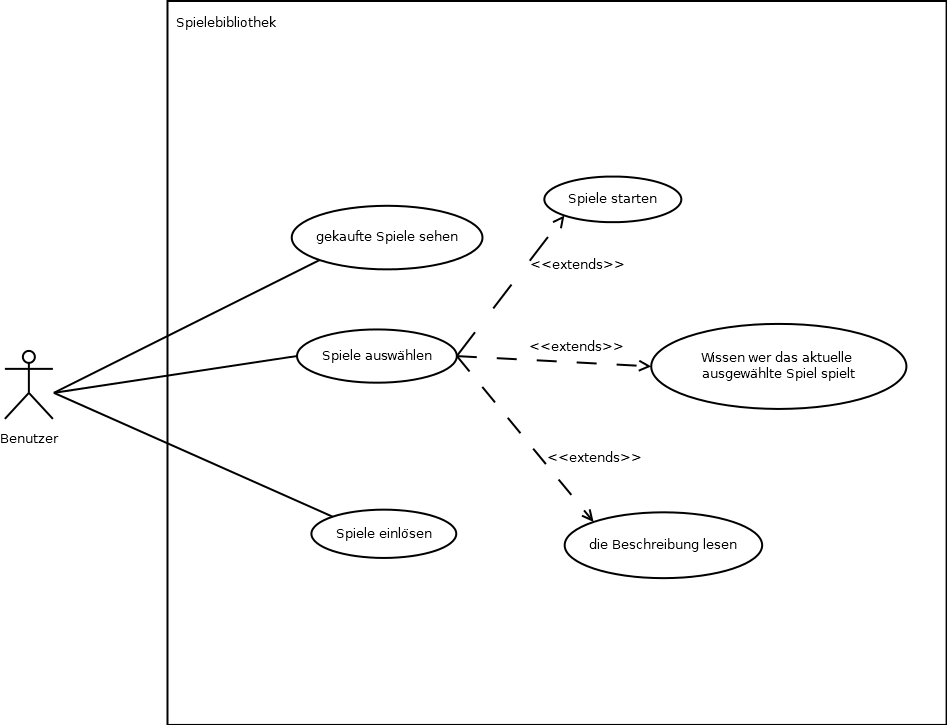
 

### Bewertungsfunktion
Die Bewertungsfunktion (Verweis / Bewertungssterne) wird bei jedem Spiel angezeigt. Jeder Benutzer kann sie individuell ausfüllen, falls er das dazugehörige Spiel besitzt. Allerdings kann jedes Spiel nur einmal pro Benutzer bewertet werden. Jeder Benutzer kann zu seiner Bewertung von einem bis zu fünf Sternen einen kleinen Text verfassen, indem er seine Meinung zum entsprechenden Spiel schreibt. Andere Benutzer sehen bei jedem Spiel, die Bewertungen jener Benutzer, die das Spiel bewertet haben und können diese Bewertungen mit einem Daumen hoch oder runter ebenfalls bewerten.  Mit einem Daumen nach oben bewertet man das Spiel positiv, mit einem Daumen nach unten negativ.

#### Mockups Bewertungsfunktion
  

#### User-Stories

| Rolle        | In meiner Rolle möchte ich               | so dass                                  | Akzeptanz                                | Priorität |
| ------------ | ---------------------------------------- | ---------------------------------------- | ---------------------------------------- | --------- |
| Als Benutzer | Bewertungssterne vergeben                | ich meine eigenen Computerspiele kurz bewerte. | maximal 1x pro Computerspiel im eigenen Besitz | KANN      |
| Als Benutzer | Bewertungstexte verfassen                | ich meine eigenen Computerspiele ausführlich bewerte. | maximal 1x pro Computerspiel im eigenen Besitz | KANN      |
| Als Benutzer | Bewertungssterne sehen                   | ich individuelle sowie Durchschnittsbewertungen von Computerspielen angezeigt bekomme. |                                          | KANN      |
| Als Benutzer | Bewertungstexte lesen                    | ich Meinungen anderer Benutzer zu Computerspielen erfahre. |                                          | KANN      |
| Als Benutzer | fremde Bewertungen pro oder contra beurteilen | ich meine Meinung dazu äußere.           |                                          | KANN      |

#### Use-Case-Diagramm
 
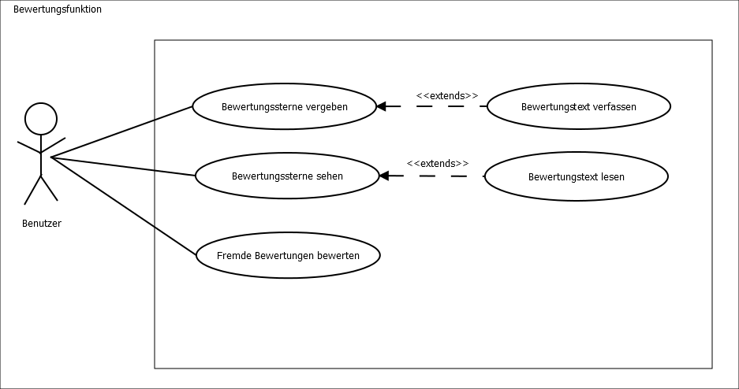
 

### Gruppen
Jeder angemeldete Benutzer kann eine Gruppe erstellen. Gruppen dienen zur Organisation von Freunden und Freundesfreunden. Um eine Gruppe zu erstellen braucht man nicht zwingend Freunde in der Kontaktliste; Da man die Option hat, die Gruppe auf "Öffentlich" zu stellen, sodass jeder Benutzer beitreten kann.
Stellt man die Gruppe auf "Privat" können nur Mitglieder beitreten, die von einem berechtigten Mitglied der Gruppe eingeladen werden.
Der Admin kann an die Mitglieder Rollen verteilen, die jeweils verschiedene Rechte haben. Mit diesen Rechten kann man Mitglieder einladen bzw. rauswerfen, die Beschreibung der Gruppe ändern oder Foren erstellen und bearbeiten.
Den Mitgliedern einer Gruppe ist es möglich sich in einem Forum zu organisieren.
In diesem Forum können verschiedene Obertabs erstellt werden und in diesen Beiträge verfasst werden. Ein Obertab kann nur von einem Mitglied erstellt werden, der Forumrechte hat. Mitglieder ohne diese Rechte können nur in den Oberthemen Unterthemen erstellen.
Beiträge können als gelesen und ungelesen markiert werden. Ein Beitrag ist ungelesen, wenn er neu erstellt wurde oder ein oder mehrere neue Kommentare hinzugefügt wurden. Der Benutzer kann sie über eine Schaltfläche als gelesen markieren oder den Beitrag öffnen, damit er als ungelesen markiert wird.  
Bei jedem Beitrag gibt es eine Kommentarfunktion, wo sich die Mitglieder zu dem Thema austauschen können.
Außerdem können Gruppen Termine zu verschiedenen Anlässe erstellen im Terminplaner.
Auf der Mobilenansicht wird in der Mitgliederliste der aktuelle Status der Mitglieder über einen farbigen Punkt dargestellt. Jede Farbe steht dabei für eine Aktivität: Grün - Online, Gelb - Abwesen, Rot - Offline, Blau - Im Spiel

#### Mockups Gruppenprofil
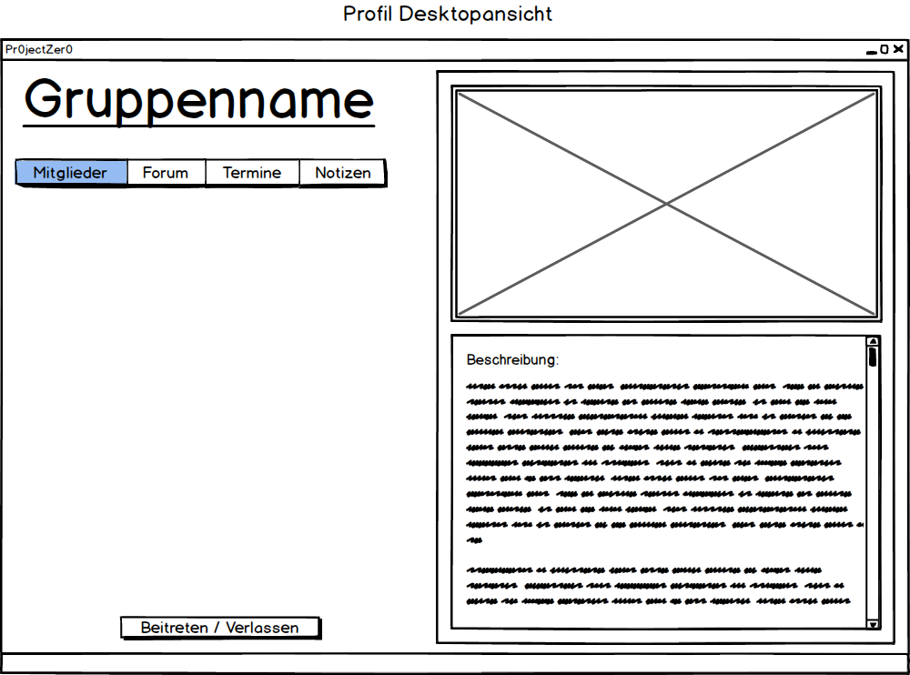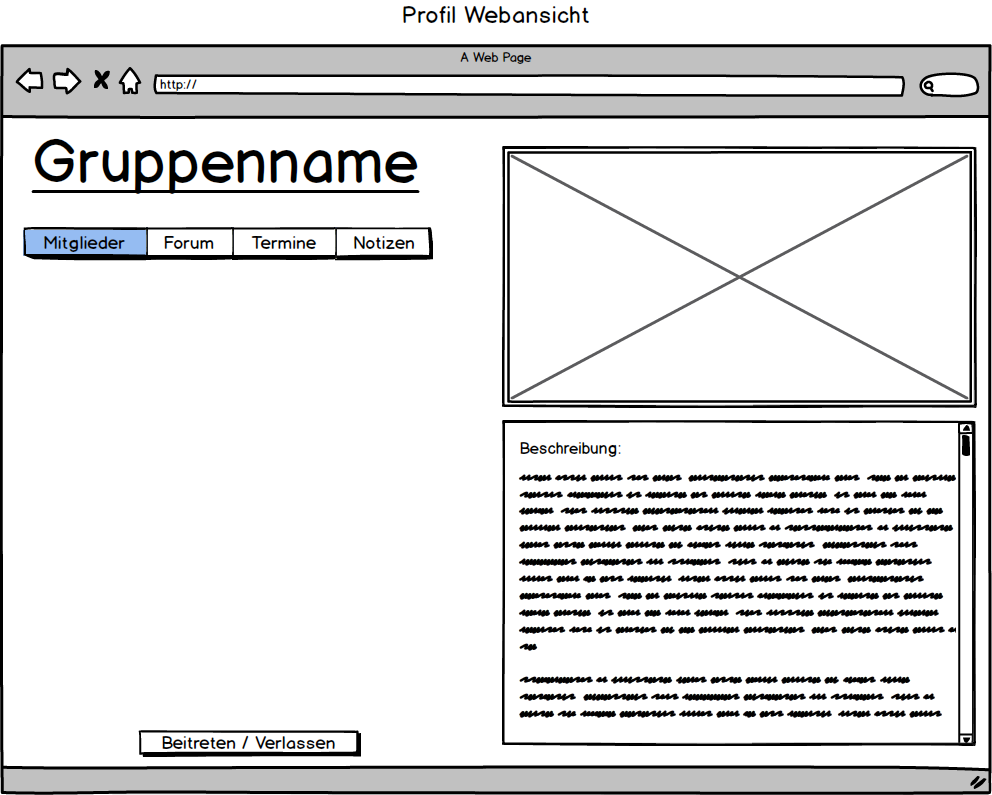
#### Mockups Gruppenforum

#### Mockups Forumbeitrag
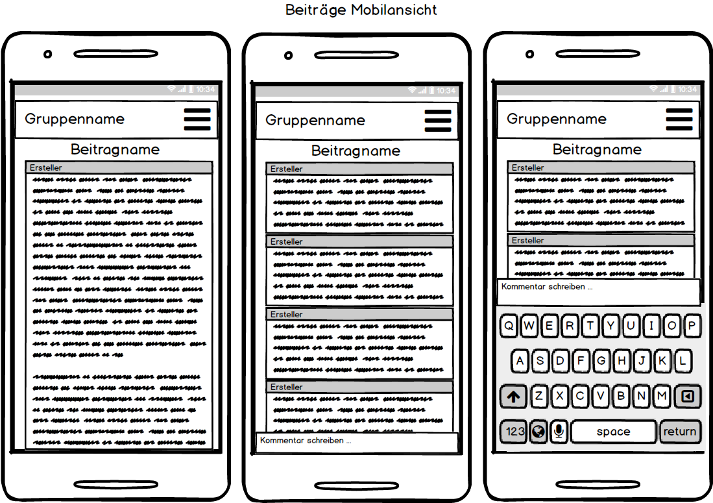
#### Mockups Gruppenmitglieder

#### Mockups Gruppenmitglieder (Adminsicht)
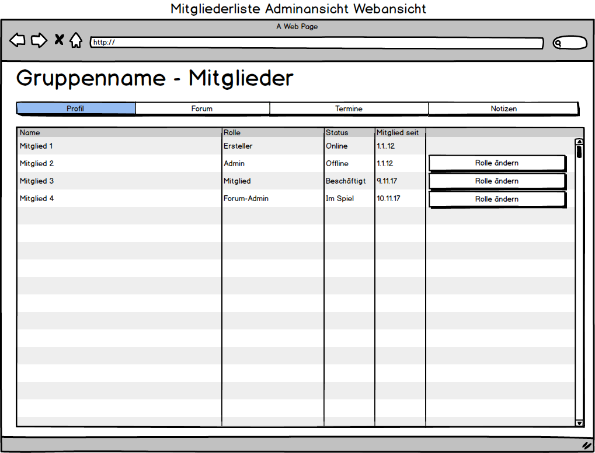

#### Gruppenrollen
| Name        | Vergabe                            | Rechte                                   |
| :---------- | :--------------------------------- | :--------------------------------------- |
| Ersteller   | Beim Erstellen der Gruppe          | Alle                                     |
| Admin       | Vergabe durch Admin oder Ersteller | Rechte des Foren-Admins + Einladen, Ausladen von Mitgliedern, Ernennung von anderen Admins |
| Foren-Admin | Vergabe durch Admin oder Ersteller | Rechte eines Mitglieds + Bearbeitung des Forums |
| Mitglied    | Beim Beitritt in die Gruppe        | Schreiben von Beiträgen, Erstellen von Terminen, Erstellen von Notizen |

#### User-Stories

| Rolle                                   | In meiner Rolle möchte ich               | so dass                                  | Akzeptanz                                | Priorität |
| --------------------------------------- | ---------------------------------------- | ---------------------------------------- | ---------------------------------------- | --------- |
| Als Benutzer                            | Gruppen erstellen                        | ich Freunde zur Gruppe hinzufügen kann   | Erzeugung der Gruppe                     | MUSS      |
| Als Benutzer                            | öffentlichen Gruppen beitreten oder Gruppeneinladungen Akzeptieren | ich mit der Gruppe Kommunizieren und an Terminen teilnehmen kann | Man sieht sich selbst in und die Inhalte der Gruppe | MUSS      |
| Als Benutzer                            | Chats der Gruppe beitreten               | ich mit anderen Gruppenmitgliedern reden kann | Aktiver Chat mit Gruppenmitgliedern      | MUSS      |
| Als Gruppenadmin                        | die Sichtbarkeit der Gruppe ändern       | sie Öffentlich oder Privat ist           |                                          | SOLL      |
| Als Gruppenadmin                        | Rollen erstellen und diese verteilen können | ausgewählte Gruppenmitglieder besondere Rechte haben |                                          | SOLL      |
| Als Gruppenadmin/Benutzer mit der Rolle | Obertabs in den Foren erstellen          | Diskussionen im Forum geordneter sind    | sichtbare Oberthemen im Forum            | SOLL      |
| Als Gruppenmitglied                     | Unterthemen im Forum erstellen           | Diskussionen angeregt werden             | sichtbare Unterthemen im Forum           | SOLL      |
| Als Gruppenmitglied                     | meine Unterthemen als gelesen und ungelesen markieren | erkannt wird, ob alles gelesen wurde oder nicht | Themen sind markiert als gelesen oder ungelesen | KANN      |
| Als Gruppenmitglied                     | meine Kommentare and Unterthemen senden  | jeder meine Meinung zum Thema sehen kann | Kommentar wird im Unterthema angezeigt   | SOLL      |
| Als Mobilnutzer                         | die Aktivität anderer Gruppenmitglieder sehen | ich weiß ob sie gerade anwesend sind oder nicht | Benutzer sind in der Mitgliederliste mit Punkten markiert | KANN      |

#### Use-Case-Diagramm

 
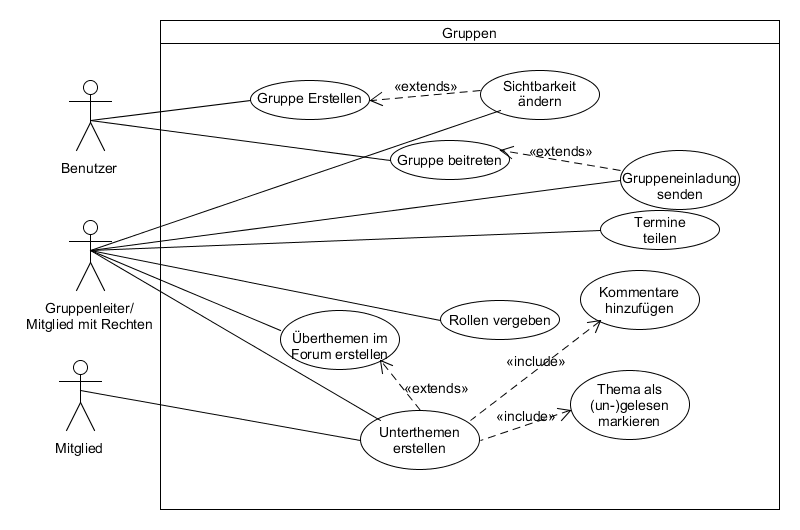
 

### Chaträume
Es wird zwischen Privatchat-, Gruppenchat- und öffentlichen Chaträumen unterschieden. In den Chaträumen stehen Emojis zur Verfügung. Hyperlinks müssen anklickbar sein. Beim Senden einer Textnachricht wird zuerst der Benutzername und dann die Textnachricht, getrennt mit einem ":", angezeigt.
Man kann Privatchats über einen Doppelklick auf den jeweiligen Kontakt öffnen. Öffentliche Chaträume können erstellt und mit Passwörtern versehen werden. Jeder öffentlicher Chatraum muss einen einzigartigen Namen haben. Es steht eine Liste mit aktiven in den Chat beigetretenen Benutzern zur Verfügung. Über diese Liste können Benutzer zu den Kontakten hinzugefügt werden. Benutzer können Stumm geschaltet werden.
Über die Gruppenliste kommt man per Doppelklick in den Gruppenchat. Rechts des Gruppenchats wird eine Liste mit den Mitgliedern angezeigt.
Um eine bessere Übersicht in den Notizen zu haben, falls man mehrere Mitarbeiter hat, kann man sich eine Farbe auswählen. Mit dieser Farbe wird der vom Benutzer geschriebene Text hinterlegt. Jede Farbe kann dabei nur von einem Benutzer verwendet werden um Verwechslungen zu vermeiden.
#### Mockups Übersicht Chaträume

#### Mockups öffentliche & Gruppen-Chaträume
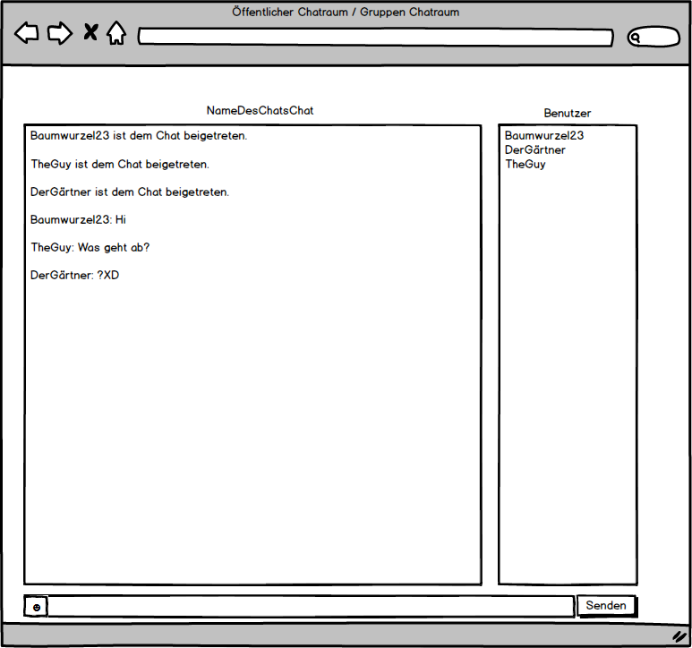
#### Mockups private Chaträume
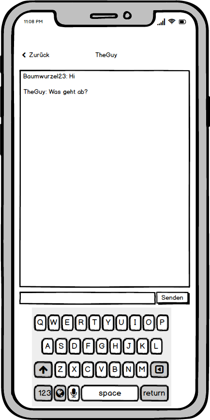

#### User-Stories
| Rolle         | In meiner Rolle möchte ich               | so dass                                  | Akzeptanz                                | Priorität |
| ------------- | ---------------------------------------- | ---------------------------------------- | ---------------------------------------- | --------- |
| Als Benutzer  | Nachrichten verschicken                  | ich mich mit anderen Benutzern unterhalten kann. | Nachrichten können an Benutzer verschickt werden, wenn eine Freundschaft bestätigt wurde. | MUSS      |
| Als Benutzer  | ich sehen, wer im Chat mitliest und geschrieben hat | ich weiß, wer beteiligt ist.             | Eine Liste aller aktiver Chatteilnehmer ist verfügbar. Bei jeder Nachricht wird der Verfasser und die Uhrzeit der Nachricht angezeigt | MUSS      |
| Als Benutzer  | meinem Chatraum einen Namen geben können | ich meine Chaträume auseinanderhalten kann. | Chaträume können umbenannt werden.       | MUSS      |
| Als Benutzer  | Benutzer stumm schalten können           | mich störende Benutzer nicht weiter belästigen können. | Benutzer können blockiert werden.        | MUSS      |
| Als Benutzer  | bei neuen Nachrichten benachrichtigt werden | ich immer auf dem aktuellen Stand bin.   | Wenn eine Nachricht in einem Chat gesendet wird, werden alle anderen Benutzer benachrichtigt. | MUSS      |
| Als Benutzer  | Benutzer als Freund hinzufügen können    | ich alle meine Kontakte in meiner Freundesliste habe. | Jeder Benutzer kann über sein Profil eine Freundschaftsanfrage gesendet werden. | MUSS      |
| Als Benutzer  | Benutzern eine einzigartige Farbe zuweisen können | ich sie auseinander halten kann.         | Jedem Benutzer kann im Chat eine Farbe einzigartige Farbe zugewiesen werden. | MUSS      |
| Als Chatadmin | andere Benutzer hinzufügen und entfernen können | ich die Kontrolle über die Teilnehmer behalte. | Der Chatadmin kann Benutzer hinzufügen sowie entfernen. | MUSS      |

#### Use-Case-Diagramm
 
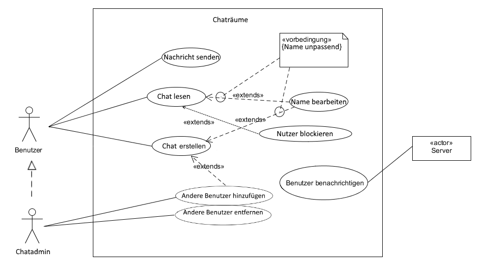
 

### Freundesliste
Es gibt die Tabs "Freunde" und "Gruppen". In dem Tab "Freunde" werden die Freunde des jeweiligen Benutzers aufgelistet und in dem "Gruppen" Tab die Gruppen. Es können Freunde hinzufügt und gelöscht werden. Diese Freunde werden dann mit einem Status angezeigt. Der Status kann zwischen Online, Offline, Beschäftigt und Abwesend, die jeweils mit einer Farbe makiert sind, variieren. Außerdem bekommt man angezeigt, in welchem Chatraum bzw. Spiel sie sich gerade befinden. Es sind ebenfalls Funktionen zum Öffnen eines Privatchats, Löschen des Freundes, Hinzufügen des Freundes und zum Wechseln des Status vorhanden. Das Anzeigen des derzeitigen Spiels/Chatraums erfolgt automatisch. Es können Gruppen erstellt und von dem jeweiligen Gruppenadmin gelöscht werden. Man kann Gruppe beitreten und sie verlassen. Andere Kontakte können in Gruppen eingeladen werden.

#### Mockups Freundesliste
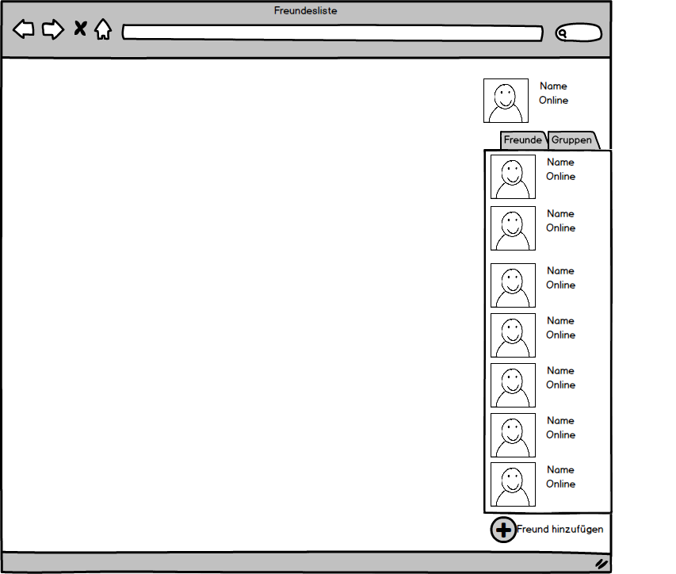

#### User-Stories
| Rolle        | In meiner Rolle möchte ich               | so dass                                  | Akzeptanz                                | Priorität |
| ------------ | ---------------------------------------- | ---------------------------------------- | ---------------------------------------- | --------- |
| Als Benutzer | Freunde meiner Freundesiste hinzufügen,  | ich sie in meiner Freundesliste sehen kann. | Auftauchen des hinzugefügten Benutzers in der Freundesliste. | MUSS      |
| Als Benutzer | Freunde von meiner Freundesliste entfernen, | sie nicht mehr in der Freundesliste sind. | Freund ist nicht mehr in der Freundesliste | MUSS      |
| Als Benutzer | einen Status haben und den von anderen Benutzern sehen, | ich sehen ob ein Benutzer erreichbar ist/ich zeigen kann ob ich erreichbar bin. | Sichtbarer Status.                       | MUSS      |
| Als Benutzer | Statis in verschiedenen Farben sehen,    | ich sie besser unterscheiden kann.       | Verschiedenfarbige Statis.               | SOLL      |
| Als Benutzer | die aktuelle Aktivität(beigetretener Chatraum, gestartetes Spiel) anderer Benutzer sehen, | andere Benutzer daran teilhaben können.  | Aktivitäten werden angezeigt.            | SOLL      |
| Als Benutzer | einen Privatchat mit Freunden öffnen können, | ich mich mit ihnen unterhalten kann.     | Funktionierender Privatchat              | MUSS      |
| Als Benutzer | Gruppierungen erstellen können,          | ich eine bessere Übersicht über meine Freunde habe. | Gruppierungen können erstellt werden.    | MUSS      |
| Als Benutzer | Gruppierungen entfernen können,          | nicht verwendete Gruppierungen gelöscht werden können. | Gruppierungen können entfernt werden.    | MUSS      |
| Als Benutzer | Freunde einer Gruppierung hinzufügen,    | ich neue Freunde gruppieren kann.        | Freunde können einer Gruppierung hinzugefügt werden | MUSS      |

#### Use-Case-Diagramm
 
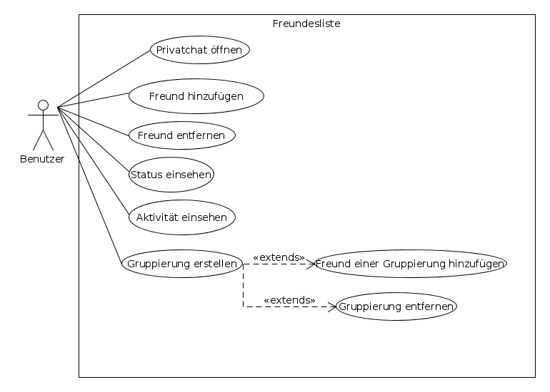
 

### Terminplaner

#### Beschreibung

Im Terminplaner soll es für den Benutzer möglich seine Termine einzutragen und auch wieder zu bearbeiten. Das bearbeiten geschieht durch drücken des Sclüssel Symbols neben dem Termin. Diese Termine können für den Benutzer selber sein oder auch für eine ganze Gruppe in der Anwendung. Wenn der Benutzer sich dafür entscheidet ein Termin für eine Gruppe zu planen, können andere für den Termin abstimmen und somit zeigen, dass sie an  dem Tag Zeit haben oder für den Termin absagen. Außerdem wird ein Gruppenmitglied zeitnah benachrichtigt, wenn eine Veranstaltung ansteht. Zur Übersicht werden die Termine in einem Kalender dargestellt, indem man auch an einem bestimmten Tag ein Termin eintragen kann. Neben dem ausgewählten Datum wird angezeigt welche Termine für dieses Datum anstehen. Tage an denen es Termine gibt, werden markiert. Beim hinzufügen, kann man den Terminnamen, die Terminbeschreibung und die Beschränkungen festlegen. Der Termin ersteller kann Leute zuweisen, welche diesen Termin sehen und eventuell auch bei dem Termin beteiligt sind. Die Teilnehmer werden in einer Liste angzeigt und können dort auch hinzugefügt werden. Dann werden sie in der Liste als hinzugefügt markiert und können auch wieder aus dem Termin entfernt werden, wenn nötig.

#### Mockups Webansicht

#### Mockups Desktopansicht

#### Mockups Mobilansicht

#### User-Stories

| Rolle               | In meiner Rolle möchte ich               | so dass                                  | Akzeptanz                                | Priorität |
| ------------------- | ---------------------------------------- | ---------------------------------------- | ---------------------------------------- | --------- |
| Als Benutzer        | Termine anlegen,                         | so dass ich sehe, wann ich verplant bin. | Die Termine werden im Kalendar farblich markiert. | MUSS      |
| Als Benutzer        | meine Termine mit Freunden teilen und ebenso deren geteilten Termine mit mir sehen, | so dass ich mich mit meinen Freunden verabreden kann und sie sehen wann ich verplant bin. |                                          | MUSS      |
| Als Benutzer        | detaillierte Beschreibung von Terminen an einem bestimmten Datum sehen, | so dass ich sehe, welche Termine an bestimmten Tagen anliegen. |                                          | MUSS      |
| Als Gruppen-Admin   | Termine mit Gruppen teilen,              | so dass meine Gruppe sieht, wie unser Spielplan ist. |                                          | MUSS      |
| Als Gruppenmitglied | die Termine meiner Gruppe sehen,         | so dass ich sehe, wann meine Gruppe Termine zum Spielen geplant hat. |                                          | MUSS      |
| Als Gruppenmitglied | sehen, welche Gruppenmitglieder an einem Termin teilnehmen und welche nicht, | so dass ich sehe wer mitmachen wird.     |                                          | SOLL      |

#### Use-Case

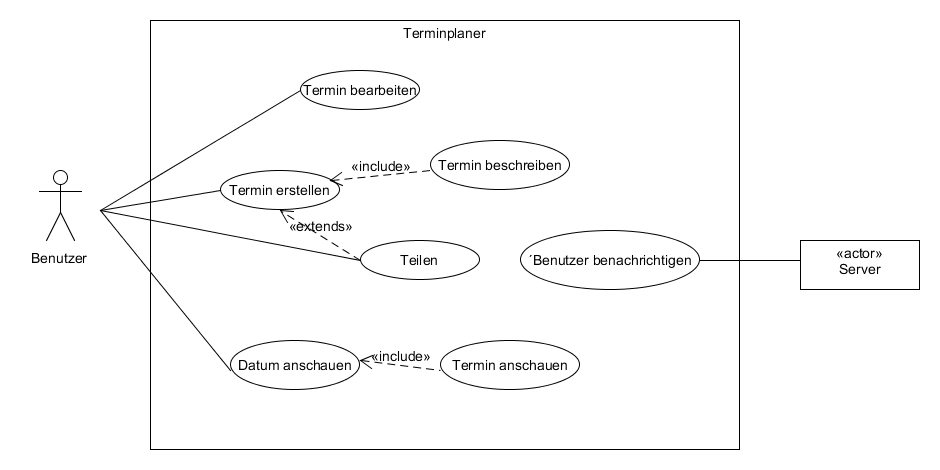

### Notizen
Dem Benutzer ist es möglich Notizen anzulegen. Diese kann er außerdem mit anderen Benutzern oder Gruppen teilen. Die Notizen können dadurch angeguckt oder von anderen bearbeitet werden. Der Notizenersteller, kann aber auch festlegen, wer diese Notiz bearbeiten darf. Die Notizen können dann auch den Benutzer oder die Benutzergruppe über festgelegte Zeit benachrichtigen. 
Zur besseren Übersicht der Notiz werden die Beiträge eines Mitgliedes in einer Farbe hinterlegt, welche man über eine Farbauswahl auswählen kann. Jede Farbe kann nur von einem Mitglied benutzt werden um Verwechslung zu vermeiden.

#### Mockups Notizen
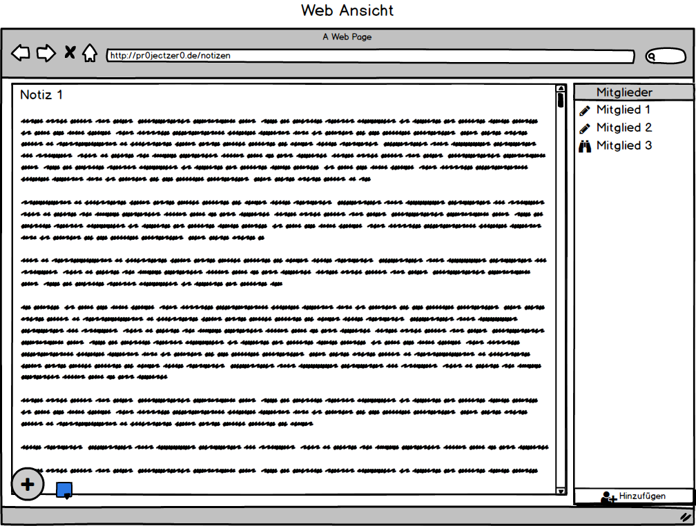 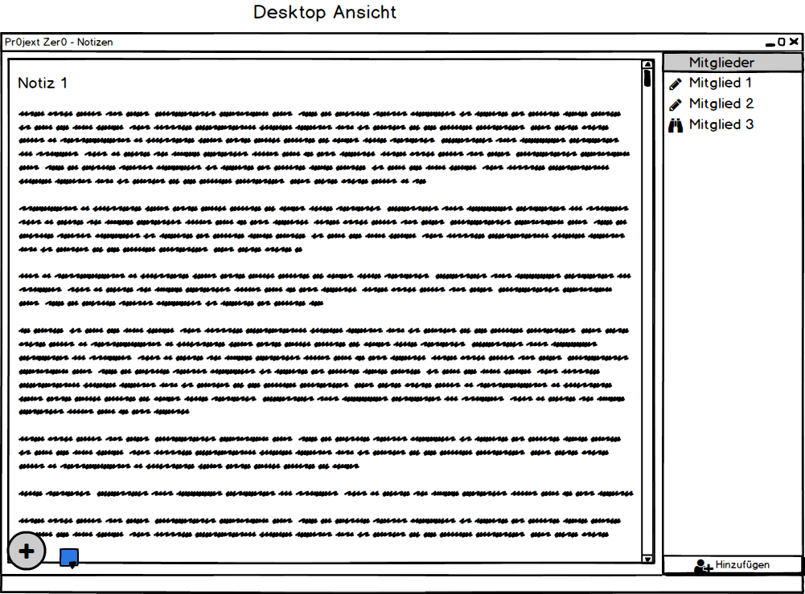 

#### User-Stories
| Rolle                | In meiner Rolle möchte ich               | so dass                                  | Akzeptanz                                | Priorität |
| -------------------- | ---------------------------------------- | ---------------------------------------- | ---------------------------------------- | --------- |
| Als Benutzer         | Notizen anlegen                          | ich wichtige Informationen immer im Blick habe. |                                          | MUSS      |
| Als Benutzer         | vorhandene Notizen bearbeiten            | ich bei kleinen Änderungen keine neue Notiz anlegen muss. |                                          | MUSS      |
| Als Benutzer         | Notizen einen Titel geben                | ich meine Notizen auseinanderhalten kann. | Der Titel soll über der eigentlichen Notiz dauerhaft angezeigt werden. | MUSS      |
| Als Benutzer         | unter meinen verschiedenen Notizen auswählen | ich aussuchen kann, welche ich einsehen will. | Die Notizen werden nur in Form ihrer Titel aufgelistet um daraus auswählen zu können. | MUSS      |
| Als Notizenersteller | meine Notizen mit anderen Nutzern oder ganzen Gruppen teilen | andere meine Notizen sehen können.       | Mitglieder werden neben der eigentlichen Notiz aufgeführt. | SOLL      |
| Als Notizenersteller | Mitgliedern die Bearbeitung der Notiz erlauben | auch andere Personen Informationen zu der Notiz beitragen können. | Der von einem Nutzer verfasste Text soll mit einer Nutzerspezifischen Farbe hinterlegt werden. | SOLL      |
| Als Mitglied         | die Farbe mit der mein Text hinterlegt ist auswählen | ich die Verfasser der Textabschnitte unterscheiden kann. | Jede Farbe soll nur einmal vorkommen um Verwechslung vorzubeugen. | KANN      |

#### Use-Case-Diagramm
 
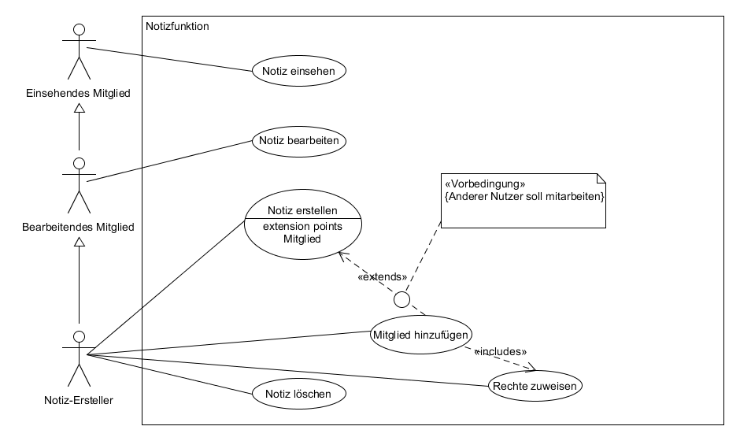
 

### Frontend
 **Clientbeschreibungen für ProjectZero**

#### Webclient
**Responsiver Webclient mit PHP, CSS, JavaScript**

| Framework | Sprache
|:------------ |:--------- |
| Laravel | PHP |
| Bootstrap | CSS |
| Angular 4 | JavaScript |

#### Mobilclient für Android und iOS
**Ionic Framework basierend auf HTML5 und AngularJS**

| Framework | Sprache
|:------------ |:--------- |
| Ionic | HTML5, AngularJS |

#### Desktop-Client für Windows
**Desktopanwendung geschrieben in C#**

### Backend

#### Server:
Ein Webserver wird für die Backend-Applikation benötigt.
Der Server benötigt mindestens diese Anforderungen, da Laravel als Backend für das Projekt benutzt wird.
Laravel ist ein PHP-Framework, welches als eine RESTful-API-Lösung benutzt wird, um die Client Anfragen zu verarbeiten und mit der Datenbank kommuniziert.

https://laravel.com/

##### Server Anforderung:

##### System:
* PHP >= 7.0.0
* OpenSSL PHP Extension
* PDO PHP Extension
* Mbstring PHP Extension
* Tokenizer PHP Extension
* XML PHP Extension

##### Software:
* Nginx oder Appache
* Composer
* Datenbank (MySQL)
* Node
* Git

#### Datenbank:
Die Datenbank kann auch in Laravel aufgebaut werden. Dafür können Migrations verwendet werden.

>Migrations are like version control for your database, allowing your team to easily modify and share the application's database schema. Migrations are
>typically paired with Laravel's schema builder to easily build your application's database schema. If you have ever had to tell a teammate to manually
>add a column to their local database schema, you've faced the problem that database migrations solve.

[Quelle](https://laravel.com/docs/5.5/migrations)

#### Systemarchitekturdiagramm
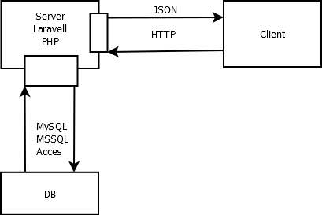

### Optionale Features
* Forum
* Shop
* Blog

### Glossar
Unser Stichwort- bzw. Begriffsverzeichnis mit Definition und Beschreibungen ebendieser.

#### Account
Ein Account ist ein Benutzerkonto, dass den Benutzer auf unserer Community-Plattform authentifiziert und autorisiert verschiedene Rollen einzunehmen.
Dieser besteht aus Benutzername, Passwort sowie E-Mail-Adresse.

#### Backend
Die logische Teil unseres Projektes. Dieser beinhaltet die Server-Applikation, die Datenbank und die Server-Hardware.

#### Benutzer
Person, die auf der Community-Plattform mindestens einen Account besitzt.

#### Benutzername
Anzeigename, den der Benutzer, bei seiner Registrierung gewählt hat. Dieser Name ist öffentlich d.h. für alle Benutzer sichtbar. Der Benutzername des Accounts darf sich aus drei bis 16 Schriftzeichen zusammensetzen. Zu den erlaubten Schriftzeichen gehören Klein- und Großbuchstaben des lateinischen Alphabets von A bis Z, die deutschen Umlaute "Ä", "Ö" und "Ü" sowie die Ziffern von 0 bis 9. Sonderzeichen und Symbole sind nicht zugelassen.

#### Bewertung
Benutzer können zu Spielen, in deren Besitz, eine individuelle Beurteilung verfassen. Jeder Benutzer darf pro Spiel maximal eine Bewertung abgeben. Diese Bewertung besteht aus einer Benotung aus Sternen von eins bis fünf (von schlecht bis sehr gut) und einem optionalen Bewertungstext aus maximal 1000 Zeichen, in dem sich die Meinung des Benutzers zum entsprechenden Computerspiel widerspiegelt. Zudem können Benutzer die Bewertungen anderer Benutzer positiv bzw. negativ bewerten. Die durchschnittliche Bewertung gibt das Mittel aus allen abgegebenen Bewertungen wider.

#### Blog
Ankündigungen über Neuigkeiten und Änderungen werden hier veröffentlicht.

#### Chat
Digitale Textnachrichtenkommunikation zwischen den Benutzern über die Community-Plattform.

#### Chatraum(e)
Fenster, um mit diversen Benutzern/Benutzergruppen Nachrichten auszutauschen. Die Aufteilung erfolgt in privaten, Gruppen- und öffentlichen Chats.

#### Community
Bezeichnet die Menge aller Accounts unserer Community-Plattform für Computerspiele.

#### Datenbank
Speicherstruktur, welche alle Benutzeranmeldedaten (Accounts) enthält.

#### Forum
Moderierte Plattform, um sich innerhalb der Community über diverse Themen auszutauschen.
Jeder angemeldete Benutzer darf Themen erstellen.

#### Freund(e)
Benutzer, die der angemeldete Benutzer zu seiner Freundeliste hinzugefügt hat.

#### Freundeliste
Liste aller Benutzer, die als Freund hinzugefügt wurden.

#### Frontend
Der visuelle Teil unseres Projektes. Die für jeden Benutzer sichtbare graphische Oberfläche (GUI), in Form der Desktop-Applikation für Desktop-Betriebssysteme, Mobile-Applikation für Smartphone-Betriebssysteme sowie der Web-Oberfläche, die plattformunabhängig verwendet werden kann. Dieser läuft auf der Client-Hardware der Benutzer.

#### Gruppe(n)
Zusammenschluss von mindestens zwei verschiedenen Benutzern, um bspw. zusammen zu chatten oder ein Computerspiel zu spielen. Die maximale Gruppengröße liegt derzeit bei 100 Benutzern.

#### Gruppenrolle(n) bzw. Rolle(n)
Benutzer haben verschiedene Rechte innerhalb einer Gruppe, die anhand der Rollen "Ersteller", "Admin", "Foren-Admin" und "Mitglied" autorisiert werden.

#### Navigationsleiste
Oberste Leiste, die den Benutzerstatus und die wichtigsten Funktionen enthält.

#### Objekt(e)
Auswählbare funktionale Elemente unsere Benutzeroberfläche.

#### Passwort
Zeichenfolge zur Authentifizierung, die der Benutzer, bei seiner Registrierung gewählt hat. Das Passwort des Accounts darf sich aus acht bis 32 Schriftzeichen zusammensetzen. Zu den erlaubten Schriftzeichen gehören Klein- und Großbuchstaben des lateinischen Alphabets von A bis Z, die deutschen Umlaute "Ä", "Ö" und "Ü", die Ziffern von 0 bis 9 sowie die üblichen Sonderzeichen "ß", "?", "!", ".", ",", "#", "@", "*", "&", "$", "€". Weitere Sonderzeichen und Symbole sind nicht zugelassen.

#### ProjectZero
Codename unseres Gruppenprojektes, welches eine Community-Plattform für Computerspiele wird.

#### Registrierung
Erstellung eines Accounts, um ein Benutzer der Community-Plattform zu werden.

#### Shop
Fenster, um PC-Spiele, Zusatzinhalte für PC-Spiele (DLC & Add-On), Lootboxen für PC-Spiele sowie Mods (Spielemodifikationen) kostenlos und kostenpflichtig zu erwerben.

#### Software
Zur Entwicklung des Projektes verwendete Anwendungen.

#### Software-System
Die Bezeichnung, für die komplette Software inklusive Server-Anwendung, Client-Anwendung sowie Dokumentation.

#### Spielebibliothek
Fenster, das alle Spiele im Besitz des jeweiligen Benutzers anzeigt.

#### Termin
Eintrag und Erinnerung an eine Veranstaltung oder Ereignis, das öffentlich, in der Gruppe oder nur privat einsehbar ist. Der Benutzer kann einem Termin zu- oder absagen.

#### Terminplaner
Kalender, der Termine für sämtliche Veranstaltungen und Ereignisse enthält. Dazu zählen öffentliche, Gruppen- und persönliche bzw. private Termine.

### Bilderverzeichnis
- Anmeldung: [Web](#img_login_web), [Desktop](#img_login_desk), [Mobil](#img_login_mobil)
- Bewertungsfunktion: [Web](#img_review_web), [Desktop](#img_review_desk), [Mobil](#img_review_mobil)
- Chaträume
  - Übersicht: [Web](#img_chat_web), [Desktop](#img_chat_desk), [Mobil](#img_chat_mobil)
  - Öffentlich/Gruppe:[Web](#img_chat_private_web), [Desktop](#img_chat_private_desk), [Mobil](#img_chat_private_mobil)
  - Privat: [Web](#img_chat_public_web), [Desktop](#img_chat_public_desk), [Mobil](#img_chat_public_mobil)
- Freundesliste: [Web](#img_friends_web), [Desktop](#img_friends_desk), [Mobil](#img_friends_mobil)
- Gruppen
  - Profil: [Web](#img_group_prof_web), [Desktop](#img_group_prof_desk), [Mobil](#img_group_prof_mobil)
  - Forum:  [Web](#img_group_forum_web), [Desktop](#img_group_forum_desk), [Mobil](#img_group_forum_mobil)
  - Mitglieder:  [Web](#img_group_members_web), [Desktop](#img_group_members_desk), [Mobil](#img_group_members_mobil)
  - Admin:  [Web](#img_group_admin_web), [Desktop](#img_group_admin_desk), [Mobil](#img_group_admin_mobil)
- Navigationsleiste:  [Web/Desktop](#img_nav_webdesk), [Mobil](#img_nav_mobil)
- Notizen: [Web](#img_notes_web), [Desktop](#img_notes_desk), [Mobil](#img_notes_mobil)
- Registrierung: [Web](#img_reg_web), [Desktop](#img_reg_desk), [Mobil](#img_reg_mobil)
- Spielebibliothek: [Web](#img_library_web), [Desktop](#img_library_desk)
- [Systemarchitektur](#img_sysarch)
- Terminplaner
  - Übersicht: [Web](#img_cal_web), [Desktop](#img_cal_desk), [Mobil](#img_cal_mobil)
  - Termin hinzufügen: [Web](#img_cal_add_web), [Desktop](#img_cal_add_desk), [Mobil](#img_cal_add_mobil)

**Fehlende Einträge, sowie Rollenverteilung werden hinzugefügt, sobald es zur Entwicklung kommt.**
