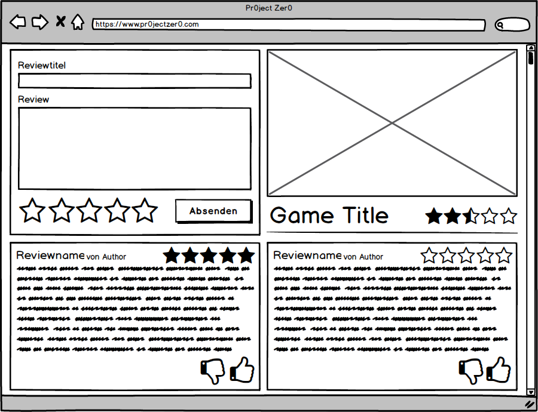

## Pflichtenheft

### Allgemeine Beschreibung des Projekts

Community-Plattform für Computerspiele

### Spiele-Bibliothek
In der Spielebibliothek werden alle verfügbaren (gekauften) Spiele angezeigt. 
Diese können dann aus der Spielebibliothek gestartet werden. 
Spiele können über ein Menü der Bibliothek hinzugefügt werden. Für jedes Spiel wird eine Beschreibung, 
eine Bewertung und die Kontakte angezeigt welche im Moment dieses Spiel spielen und besitzen angezeigt.
### Bewertungsfunktion
Die Bewertungsfunktion(Verweis/Bewertungssterne) wird bei jedem Spiel anzeigt. 
Jeder Benutzer kann sie individuell ausfüllen, wenn er das dazugehörige Spiel besitzt, 
aber jedes Spiel kann nur einmal pro Benutzer bewertet werden.
Jeder Benutzer kann zu seiner Bewertung ein kleiner Text verfassen, 
dort kann er schreiben was er gut und/oder schlecht an diesem Spiel findet und eine Bewertung in Sternen abgeben. 
Andere Benutzer sehen bei jedem Spiel, die Bewertung von jedem Benutzer, 
der das Spiel bewertet hat und können diese Bewertungen mit einem Daumen hoch oder runter bewerten.  

### Terminplaner
Im Terminplaner soll es für den Benutzer möglich seine Termine einzutragen. Diese Termine können für den Benutzer selber sein oder auch für eine ganze Gruppe in der Anwendung. Wenn der Benutzer sich dafür entscheidet ein Termin für eine Gruppe zu planen, können andere für den Termin abstimmen und somit zeigen, dass sie an  dem Tag Zeit haben oder für den Termin absagen. Außerdem wird ein Gruppenmitglied zeitnah benachrichtigt, wenn eine Veranstaltung ansteht. Zur Übersicht werden die Termine in einem Kalender dargestellt, indem man auch an einem bestimmten Tag ein Termin eintragen kann.
### Gruppen
### Chaträume
Es wird zwischen Privatchats, Gruppenchats und öffentliche Chaträumen unterschieden. In den Chaträumen stehen Emojis zur Verfügung. Hyperlinks müssen anklickbar sein. Beim Senden einer Textnachricht wird zuerst der Benutzername und dann mit einem ":" getrennt die Textnachricht angezeigt.
Man kann Privatchats über einen Doppelklick auf den jeweiligen Kontakt öffnen.
Öffentliche Chaträume können erstellt und mit Passwörtern versehen werden. Jeder öffentlicher Chatraum muss einen einzigartigen Namen haben. Es steht eine Liste mit aktiven in den Chat beigetretenen Benutzern zur Verfügung. Über diese Liste können Benutzer zu den Kontakten hinzugefügt werden. Benutzer können Stumm geschaltet werden. 
Über die Gruppenliste kommt man per Doppelklick in den Gruppenchat. Rechts des Gruppenchats wird eine Liste mit den Mitgliedern angezeigt.
### Kontaktliste
Es gibt die Tabs "Kontakte" und "Gruppen". In dem Tab "Kontakte" werden die Kontakte des jeweiligen Benutzers aufgelistet und in dem "Gruppen" Tab die Gruppen. Es können Freunde hinzufügt und gelöscht werden. Diese Freunde werden dann mit einem Status angezeigt. Der Status kann zwischen Online, Offline, Beschäftigt und Abwesend variieren. Außerdem bekommt man angezeigt, in welchem Chatraum bzw. Spiel sie sich gerade befinden. Es sind ebenfalls Funktionen zum Öffnen eines Privatchats, Löschen des Freundes, Hinzufügen des Freundes und zum Wechseln des Status vorhanden. Das Anzeigen des derzeitigen Spiels/Chatraums erfolgt automatisch. Es können Gruppen erstellt und gelöscht werden. Man kann Gruppe beitreten und sie verlassen. Andere Kontakte können in Gruppen eingeladen werden.
### Notizen
Dem Benutzer ist es möglich Notizen anzulegen. Diese kann er außerdem mit anderen Benutzern oder Gruppen teilen. Die Notizen können dadurch angeguckt oder von anderen bearbeitet werden. Der Notizenersteller, kann aber auch festlegen, wer diese Notiz bearbeiten darf. Die Notizen können dann auch den Benutzer oder die Benutzergruppe über festgelegte Zeit benachrichtigen.
### Frontend
 **Clientbeschreibungen für ProjectZero**

#### Webclient

**Responsiver Webclient mit PHP, CSS, JavaScript**

| Framework | Sprache 
|:------------ |:--------- |
| Laravel | PHP |
| Bootstrap | CSS |
| Angular 4 | JavaScript |

#### Mobilclient für Android und iOS
**Ionic Framework basierend auf HTML5 und AngularJS**

| Framework | Sprache 
|:------------ |:--------- |
| Ionic | HTML5, AngularJS |

#### Desktop-Client für Windows
**Desktopanwendung geschrieben in C#**

### Backend

#### Server:
Ein Webserver wird für die Backend Applikation benötigt.
Der Server benötigt mindestens diese Anforderungen, da Laravel als Backend für das Projekt benutzt wird.
Larvel ist ein PHP Framework, welches als eine RESTful API Lösung benutzt wird um die Client Anfragen zu verarbeiten und mit der Datenbank kommuniziert.

https://laravel.com/

##### Server Anforderung:

##### System:
* PHP >= 7.0.0	
* OpenSSL PHP Extension
* PDO PHP Extension
* Mbstring PHP Extension
* Tokenizer PHP Extension
* XML PHP Extension

##### Software:
* Nginx oder Appache
* Composer
* Datenbank (MySQL)
* Node
* Git

#### Datenbank:
Die Datenbank kann auch in Laravel aufgebaut werden, dafür können Migrations verwedendet werden.

>Migrations are like version control for your database, allowing your team to easily modify and share the application's database schema. Migrations are 
>typically paired with Laravel's schema builder to easily build your application's database schema. If you have ever had to tell a teammate to manually 
>add a column to their local database schema, you've faced the problem that database migrations solve.

[Quelle](https://laravel.com/docs/5.5/migrations) 

### Optionale Features
* Forum
* Shop
* Blog

**Fehlende Einträge, sowie Rollenverteilung werden hinzugefügt, sobald es zur Entwicklung kommt.**