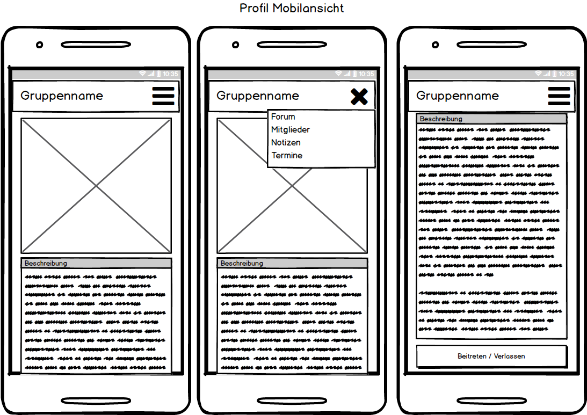
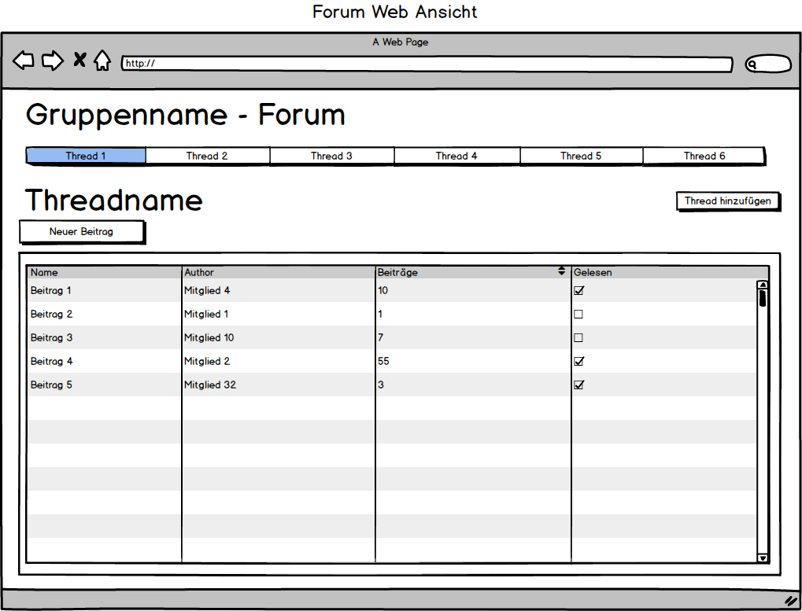
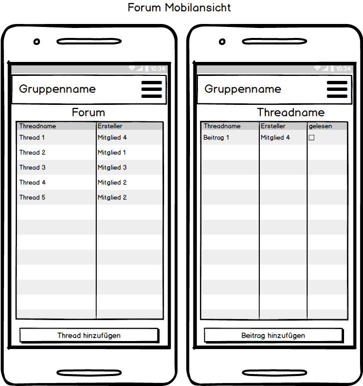
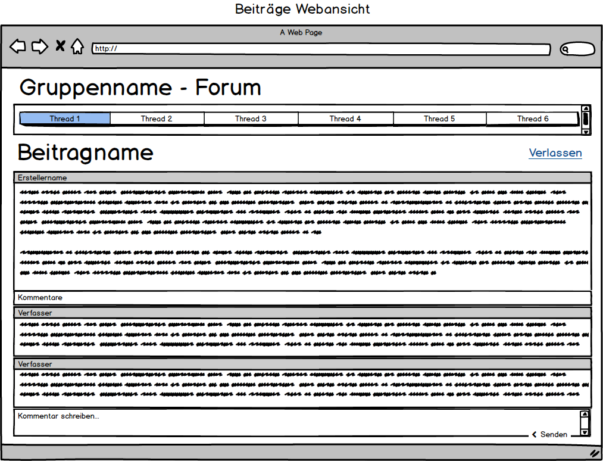
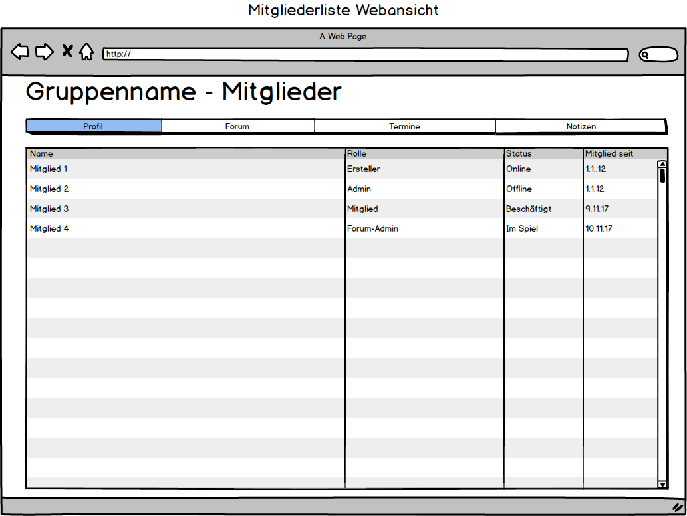
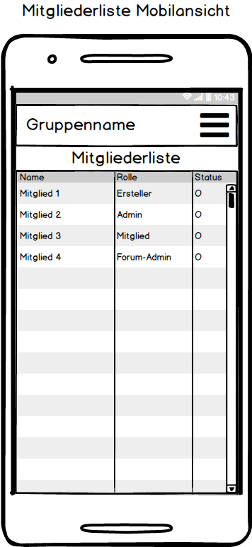
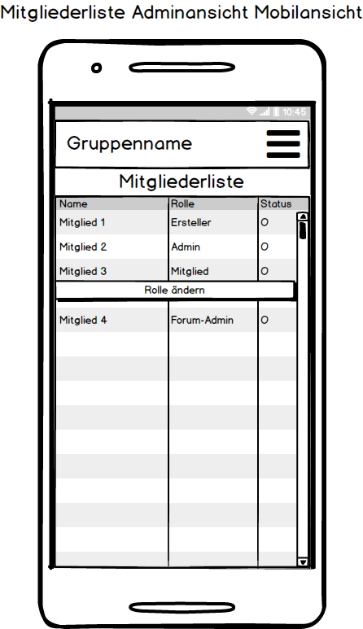
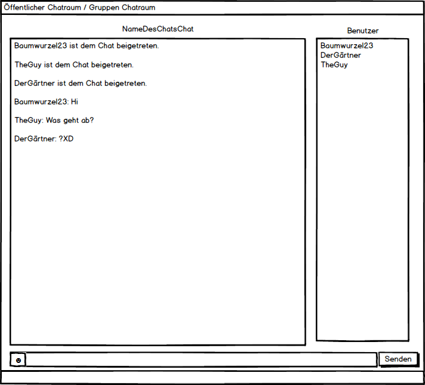
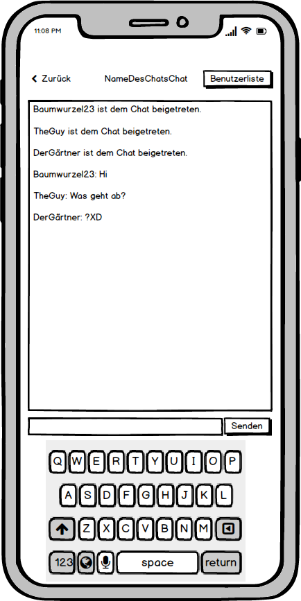
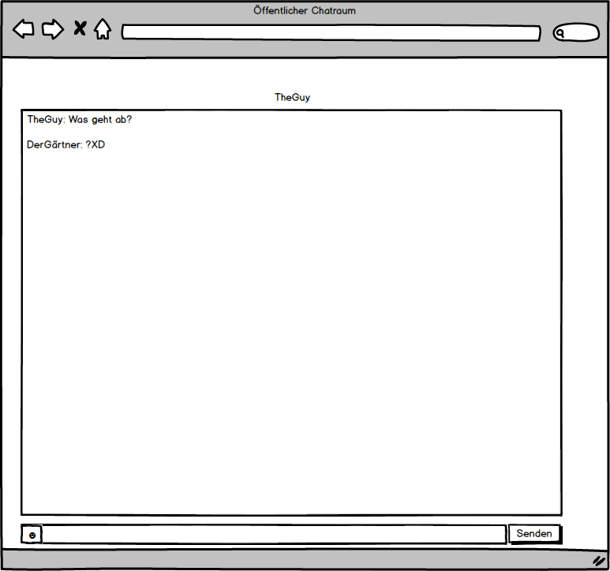

## Pflichtenheft

### Allgemeine Beschreibung des Projekts

Community-Plattform für Computerspiele

### Navigationsleiste
Die Navigationsleiste ist allen anderen Objekten übergeordnet. Sie wird also über jedem Objekt dargestellt.
Sie beinhaltet die wichtigsten Verweise. Ein Verweis auf die Registrierung, Anmeldung oder Abmeldung.
Ihr Inhalt der Navigationsleiste lautet wie folgt:
* Logo der Plattform (Verweis auf die Startseite)
* Terminplaner
* Spielebibliothek
* Gruppen/Freunde (Community)
* Registrierung und Anmeldung oder Abmeldung  

### Registrierung
Jede Person kann sich registrieren, egal ob über die Web-Anwendung, Desktop-Anwendung oder Mobile-Anwendung. 
Für die Registration muss man einen noch nicht vergebenen Benutzernamen, eine noch nicht verwendete E-Mail und ein Passwort angeben.
Das Passwort muss wiederholt werden um Schreibfehler vorzubeugen.  
  

### Anmeldung
Jede Person die sich erfolgreich registriert hat, kann sich anmelden. 
Um sich anzumelden, muss eine korrekte Eingabe von Benutzername und Passwort getätigt werden.
  

### Spielebibliothek
In der Spielebibliothek werden alle verfügbaren (gekauften) Spiele angezeigt. 
Diese können dann aus der Spielebibliothek gestartet werden. 
Spiele können über ein Menü der Bibliothek hinzugefügt werden. Für jedes Spiel wird eine Beschreibung, 
eine Bewertung und die Benutzer angezeigt, welche im Moment dieses Spiel spielen und somit auch besitzen müssen.  
 

### Bewertungsfunktion
Die Bewertungsfunktion (Verweis / Bewertungssterne) wird bei jedem Spiel angezeigt. 
Jeder Benutzer kann sie individuell ausfüllen, falls er das dazugehörige Spiel besitzt. 
Allerdings kann jedes Spiel nur einmal pro Benutzer bewertet werden.
Jeder Benutzer kann zu seiner Bewertung von einem bis zu fünf Sternen einen kleinen Text verfassen, 
indem er seine Meinung zum entsprechenden Spiel schreibt. 
Andere Benutzer sehen bei jedem Spiel, die Bewertungen jener Benutzer, 
die das Spiel bewertet haben und können diese Bewertungen mit einem Daumen hoch oder runter ebenfalls bewerten.  
  

### Gruppen
Jeder angemeldete Benutzer kann eine Gruppe erstellen. Gruppen dienen zur Organisation von Freunden und Freundesfreunden. Um eine Gruppe zu erstellen braucht man nicht zwingend Freunnde in der Kontaktliste; Da man die Option hat, die Gruppe auf "Öffentlich" zu stellen, sodass jeder Benutzer beitreten kann.
Stellt man die Gruppe auf "Privat" können nur Mitglieder beitreten, die von einem berechtigten Mitglied der Gruppe eingeladen werden. 
Der Admin kann an die Mitglieder Rollen verteilen, die jeweils verschiedene Rechte haben. Mit diesen Rechten kann man Mitglieder einladen bzw. rauswerfen, die Beschreibung der Gruppe ändern oder Foren erstellen und bearbeiten.
Den Mitgliedern einer Gruppe ist es möglich sich in einem Forum zu organisieren. 
In diesem Forum können verschiedene Obertabs erstellt werden und in diesen Beiträge verfasst werden. Ein Obertab kann nur von einem Mitglied erstellt werden, der Forumrechte hat. Mitglieder ohen diese Rechte können nur in den Oberthemen Unterthemen erstellen. 
Beiträge können als gelesen und ungelesen markiert werden. Ein Beitrag ist ungelesen, wenn er neu erstellt wurde oder ein oder mehrere neue Kommentare hinzugefügt wurden. Der Benutzer kann sie über eine Schaltfläche als gelesen markieren oder den Beitrag öffnen, damit er als ungelesen markiert wird.  
Bei jedem Beitrag gibt es eine Kommentarfunktion, wo sich die Mitglieder zu dem Thema austauschen können.
Außerdem können Gruppen Termine zu verschiedenen Anlässe erstellen im Terminplaner.
Auf der Mobilenansicht wird in der Mitgliederliste der aktuelle Status der Mitglieder über einen farbigen Punkt dargestellt. Jede Farbe steht dabei für eine Aktivität: Grün - Online, Gelb - Abwesen, Rot - Offline, Blau - Im Spiel

 

 

 

 

### Gruppenrollen 
| Name | Vergabe | Rechte | 
|:------------|:------------|:------------|
| Ersteller | Beim Erstellen er Gruppe | Alle |
| Admin | Vergabe durch Admin oder Ersteller | Rechte des Forum-Admins + Einladen Ausladen von Mitgliedern, Ernennung von andern Admins |
| Forum-Admin | Vergabe durch Amin oder Ersteller | Rechte eines Mitglieds + Bearbeitung des Forums |
| Mitglied | Beim Beitreten der Gruppe | Schreiben von Beiträgen, Erstellen von Terminen, Erstellen von Notizen |

### Chaträume
Es wird zwischen Privatchat-, Gruppenchat- und öffentlichen Chaträumen unterschieden. In den Chaträumen stehen Emojis zur Verfügung. Hyperlinks müssen anklickbar sein. Beim Senden einer Textnachricht wird zuerst der Benutzername und dann die Textnachricht, getrennt mit einem ":", angezeigt.
Man kann Privatchats über einen Doppelklick auf den jeweiligen Kontakt öffnen. Öffentliche Chaträume können erstellt und mit Passwörtern versehen werden. Jeder öffentlicher Chatraum muss einen einzigartigen Namen haben. Es steht eine Liste mit aktiven in den Chat beigetretenen Benutzern zur Verfügung. Über diese Liste können Benutzer zu den Kontakten hinzugefügt werden. Benutzer können Stumm geschaltet werden. 
Über die Gruppenliste kommt man per Doppelklick in den Gruppenchat. Rechts des Gruppenchats wird eine Liste mit den Mitgliedern angezeigt.
Um eine bessere Übersicht in den Notizen zu haben, falls man mehrere Mitarbeiter hat, kann man sich eine Farbe auswählen. Mit dieser Farbe wird der vom Benutzer geschriebene Text hinterlegt. Jede Farbe kann dabei nur von einem Benutzer verwendet werden um Verwechslungen zu vermeiden.
 

 

 

### Freundesliste
Es gibt die Tabs "Freunde" und "Gruppen". In dem Tab "Freunde" werden die Freunde des jeweiligen Benutzers aufgelistet und in dem "Gruppen" Tab die Gruppen. Es können Freunde hinzufügt und gelöscht werden. Diese Freunde werden dann mit einem Status angezeigt. Der Status kann zwischen Online, Offline, Beschäftigt und Abwesend, die jeweils mit einer Farbe makiert sind, variieren. Außerdem bekommt man angezeigt, in welchem Chatraum bzw. Spiel sie sich gerade befinden. Es sind ebenfalls Funktionen zum Öffnen eines Privatchats, Löschen des Freundes, Hinzufügen des Freundes und zum Wechseln des Status vorhanden. Das Anzeigen des derzeitigen Spiels/Chatraums erfolgt automatisch. Es können Gruppen erstellt und gelöscht werden. Man kann Gruppe beitreten und sie verlassen. Andere Kontakte können in Gruppen eingeladen werden. 

### Terminplaner
Im Terminplaner soll es für den Benutzer möglich seine Termine einzutragen und auch wieder zu bearbeiten. Das bearbeiten geschieht durch drücken des Sclüssel Symbols neben dem Termin. Diese Termine können für den Benutzer selber sein oder auch für eine ganze Gruppe in der Anwendung. Wenn der Benutzer sich dafür entscheidet ein Termin für eine Gruppe zu planen, können andere für den Termin abstimmen und somit zeigen, dass sie an  dem Tag Zeit haben oder für den Termin absagen. Außerdem wird ein Gruppenmitglied zeitnah benachrichtigt, wenn eine Veranstaltung ansteht. Zur Übersicht werden die Termine in einem Kalender dargestellt, indem man auch an einem bestimmten Tag ein Termin eintragen kann. Neben dem ausgewählten Datum wird angezeigt welche Termine für dieses Datum anstehen. Tage an denen es Termine gibt, werden markiert. Beim hinzufügen, kann man den Terminnamen, die Terminbeschreibung und die Beschränkungen festlegen. Der Termin ersteller kann Leute zuweisen, welche diesen Termin sehen und eventuell auch bei dem Termin beteiligt sind. Die Teilnehmer werden in einer Liste angzeigt und können dort auch hinzugefügt werden. Dann werden sie in der Liste als hinzugefügt markiert und können auch wieder aus dem Termin entfernt werden, wenn nötig. 

### Notizen
Dem Benutzer ist es möglich Notizen anzulegen. Diese kann er außerdem mit anderen Benutzern oder Gruppen teilen. Die Notizen können dadurch angeguckt oder von anderen bearbeitet werden. Der Notizenersteller, kann aber auch festlegen, wer diese Notiz bearbeiten darf. Die Notizen können dann auch den Benutzer oder die Benutzergruppe über festgelegte Zeit benachrichtigen. 
Zur besseren Übersicht der Notiz werden die Beiträge eines Mitgliedes in einer Farbe hinterlegt, welche man über eine Farbauswahl auswählen kann. Jede Farbe kann nur von einem Mitglied benutzt werden um Verwechslung zu vermeiden. 

  

### Frontend
 **Clientbeschreibungen für ProjectZero**

#### Webclient
**Responsiver Webclient mit PHP, CSS, JavaScript**

| Framework | Sprache 
|:------------ |:--------- |
| Laravel | PHP |
| Bootstrap | CSS |
| Angular 4 | JavaScript |

#### Mobilclient für Android und iOS
**Ionic Framework basierend auf HTML5 und AngularJS**

| Framework | Sprache 
|:------------ |:--------- |
| Ionic | HTML5, AngularJS |

#### Desktop-Client für Windows
**Desktopanwendung geschrieben in C#**

### Backend

#### Server:
Ein Webserver wird für die Backend-Applikation benötigt.
Der Server benötigt mindestens diese Anforderungen, da Laravel als Backend für das Projekt benutzt wird.
Laravel ist ein PHP-Framework, welches als eine RESTful-API-Lösung benutzt wird, um die Client Anfragen zu verarbeiten und mit der Datenbank kommuniziert.

https://laravel.com/

##### Server Anforderung:

##### System:
* PHP >= 7.0.0	
* OpenSSL PHP Extension
* PDO PHP Extension
* Mbstring PHP Extension
* Tokenizer PHP Extension
* XML PHP Extension

##### Software:
* Nginx oder Appache
* Composer
* Datenbank (MySQL)
* Node
* Git

#### Datenbank:
Die Datenbank kann auch in Laravel aufgebaut werden. Dafür können Migrations verwendet werden.

>Migrations are like version control for your database, allowing your team to easily modify and share the application's database schema. Migrations are 
>typically paired with Laravel's schema builder to easily build your application's database schema. If you have ever had to tell a teammate to manually 
>add a column to their local database schema, you've faced the problem that database migrations solve.

[Quelle](https://laravel.com/docs/5.5/migrations) 

#### Systemarchitekturdiagramm

### Optionale Features
* Forum
* Shop
* Blog

### Glossar
Unser Stichwortverzeichnis mit Definition und Beschreibungen ebendieser.
**Das Glossar wird parallel zum stetigen Fortschritt des Projektes erweitert.**

#### ProjectZero
Codename unseres Gruppenprojektes, welches eine Community-Plattform für Computerspiele wird.

#### Navigationsleiste
Oberste Leiste, die den Benutzerstatus und die wichtigsten Funktionen enthält.

#### Terminplaner
Kalender, der Einträge für sämtliche Veranstaltungen beinhaltet. Dieser enthält persönliche und Gruppeneinträge und erinnert an Termine.

#### Spielebibliothek
Fenster, das alle Spiele im Besitz des jeweiligen Benutzers umfasst.

#### Community
Beschreibt alle Benutzer unseres Community-Plattform für Computerspiele.

#### Benutzer
Person, die auf der Community-Plattform mindestens einen Benutzer-Account hat.

#### Gruppe(n)
Zusammenschluss von mindestens zwei verschiedenen Spielern, um bspw. zusammen zu chatten oder ein Computerspiel zu spielen. Die maximale Gruppengröße liegt derzeit bei 100 Teilnehmern.

#### Freund(e)
Benutzer, die der angemeldete Benutzer zu seiner Freundeliste hinzugefügt hat.

#### Freundeliste
Liste aller Benutzer, die als Freund hinzugefügt wurden.

#### Chat
Schriftliche Unterhaltung der Benutzer untereinander. Die Verwendung von Emojis ist

#### Chatraum(e)
Fenster, um mit diversen Benutzergruppen zu schreiben. Die Aufteilung erfolgt nach privaten, Grupppen- und öffentliche Chats.

#### Registrierung
Erstellung eines Benutzer-Accounts mit Benutzername, Passwort sowie E-Mail-Adresse, um ein Benutzer bzw. Mitglied der Community-Plattform zu werden.

#### Anmeldung
Der Anmeldevorgang (Login-Vorgang) des Benutzers, um sich mit dem bereits erstelten Benutzer-Account zu authentifizieren und somit anzumelden.

#### Abmeldung 
Der Abmneldevorgang (Logout-Vorgang) des Benutzers, um sich mit dem bereits angemeldeten Benutzer-Account abzumelden.

#### Bewertungsfunktion
Jeder angemeldete Benutzer darf angebotene PC-Spiele auf der Community-Plattform bewerten.

#### Frontend
Der visuelle Teil unseres Projektes. Die für jeden Benutzer sichtbare graphische Oberfläche (GUI), in Form der Desktop-Applikation, Mobile-App für Smartphone-Betriebssysteme sowie der Web-Oberfläche die plattformunabhängig verwendet werden kann. Dieser läuft auf der Client-Hardware der Benutzer.

#### Backend
Die logische Teil unseres Projektes. Dieser beinhaltet die Server-Applikation, die Datenbank und die Server-Hardware.

#### Software
Zur Entwicklung des Projektes verwendete Anwendungen.

#### Datenbank
Speicherstruktur, welche alle Benutzeranmeldedaten enthält.

#### Systemarchitekturdiagramm
Graphische Darstellung der im Software-System verwendeten Komponenten mit verwendetem Framework und Programmmiersprache sowie deren Verbindungen untereinander.

#### Software-System
Die Bezeichnung, für die komplette Software inklusive Server-Anwendung, Client-Anwendung sowie Dokumentation.

#### Forum
Moderierte Plattform, um sich innerhalb der Community über diverse Themen auszutauschen.
Jeder angemeldete Benutzer darf Themen erstellen.

#### Shop
Oberfläche, um PC-Spiele, Zusatzinhalte für PC-Spiele (DLC & Add-On), Lootboxen für PC-Spiele sowie Mods (Spielemodifikationen) kostenlos und kostenpflichtig zu erwerben.

#### Blog
Ankündigungen über Neuigkeiten und Änderungen werden hier veröffentlicht.

**Fehlende Einträge, sowie Rollenverteilung werden hinzugefügt, sobald es zur Entwicklung kommt.**
