## Pflichtenheft

### Allgemeine Beschreibung des Projekts

Community-Plattform für Computerspiele

### Navigationsleiste
Die Navigationsleiste ist allem übergeordnet, also sie wird über jedem Objekt dargestellt.
Sie hat die wichtigsten Verweise in sich, ein Verweis auf die Anmeldung, Registration oder Abmeldung.
Ihr Inhalt ist wie folgt:
* Logo der Plattform (Verweis auf die Startseite)
* Terminplaner
* Spiele-Bibliothek
* Gruppen/Freunde (Community)
* Registrierung und Anmeldung oder Abmeldung  
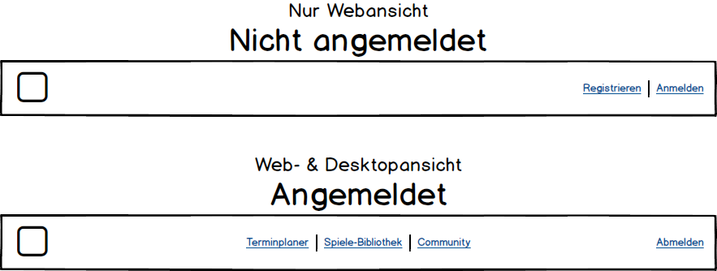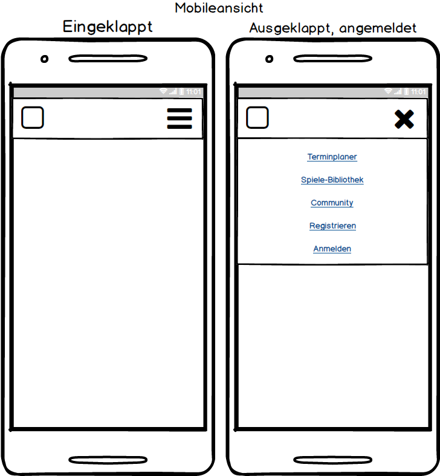

### Registrierung
Jede Person kann sich registrieren, egal ob über die Web-Anwendung, Desktop-Anwendung oder Mobile-Anwendung. 
Für die Registration muss man einen noch nicht vergebenen Benutzernamen, eine noch nicht verwendete E-Mail und ein Passwort angeben.
Das Passwort muss wiederholt werden um Schreibfehler vorzubeugen.  
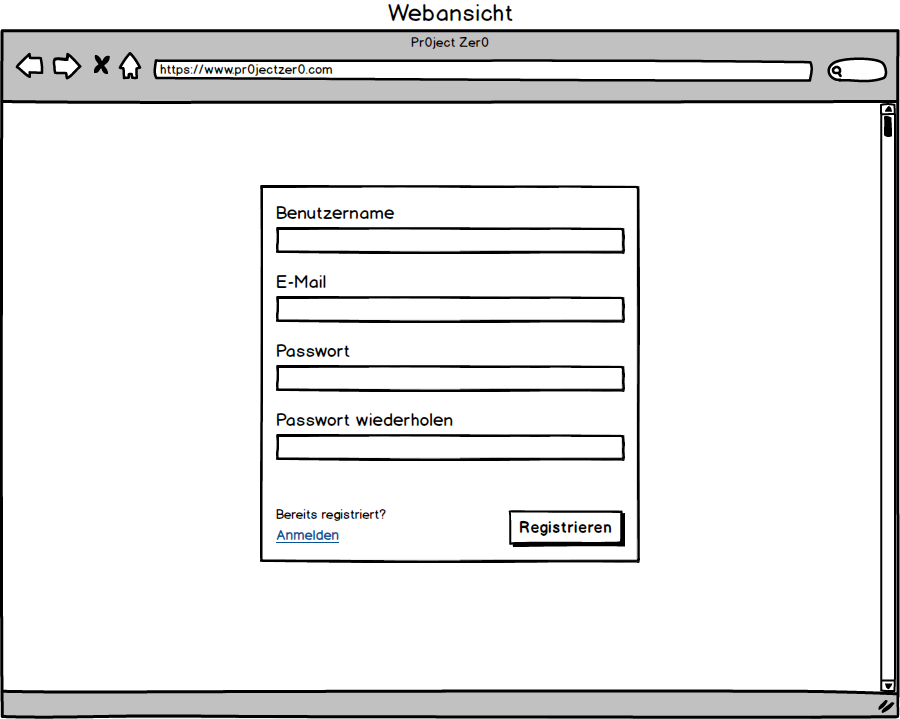 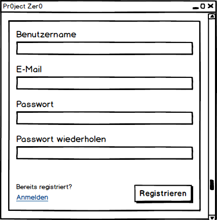 

### Anmeldung
Jede Person die sich erfolgreich registriert hat, kann sich anmelden. 
Um sich anmelden zu können, muss eine korrekte Eingabe von Benutzername und Passwort tätigt werden.  
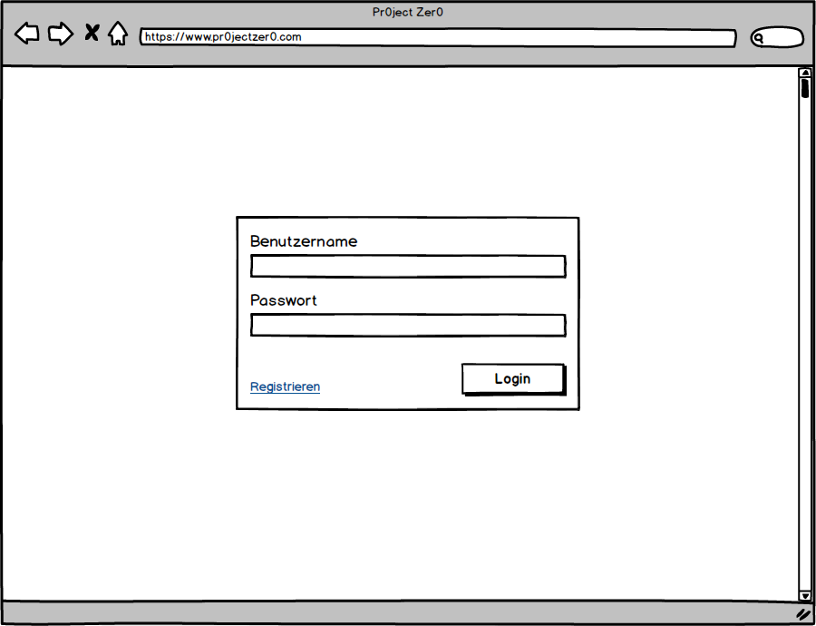  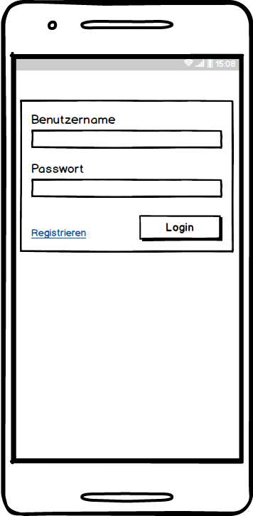

### Spiele-Bibliothek
In der Spielebibliothek werden alle verfügbaren (gekauften) Spiele angezeigt. 
Diese können dann aus der Spielebibliothek gestartet werden. 
Spiele können über ein Menü der Bibliothek hinzugefügt werden. Für jedes Spiel wird eine Beschreibung, 
eine Bewertung und die Kontakte angezeigt welche im Moment dieses Spiel spielen und besitzen angezeigt.  
 

### Bewertungsfunktion
Die Bewertungsfunktion(Verweis/Bewertungssterne) wird bei jedem Spiel anzeigt. 
Jeder Benutzer kann sie individuell ausfüllen, wenn er das dazugehörige Spiel besitzt, 
aber jedes Spiel kann nur einmal pro Benutzer bewertet werden.
Jeder Benutzer kann zu seiner Bewertung ein kleiner Text verfassen, 
dort kann er schreiben was er gut und/oder schlecht an diesem Spiel findet und eine Bewertung in Sternen abgeben. 
Andere Benutzer sehen bei jedem Spiel, die Bewertung von jedem Benutzer, 
der das Spiel bewertet hat und können diese Bewertungen mit einem Daumen hoch oder runter bewerten.  
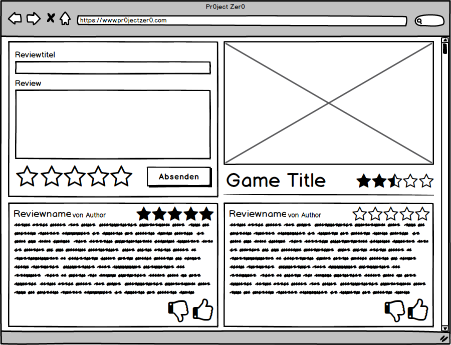  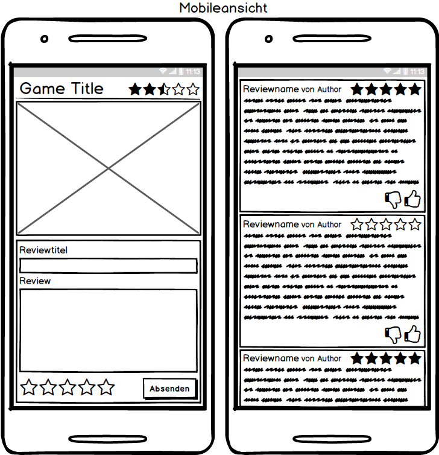

### Gruppen
Jeder angemeldete Benutzer kann eine Gruppe erstellen. Gruppen dienen zur Organisation von Freunden und Freundesfreunden. Um eine Gruppe zu erstellen braucht man nicht zwingend Freunnde in der Kontaktliste, da man die Option hat die Gruppe auf "Öffentlich" zu stellen, sodass jeder beitreten kann. 
Stellt man die Gruppe auf "Privat" können nur Mitglieder beitreten, die von einem berechtigten Mitglied der Gruppe eingeladen werden. 
Der Admin kann an die Mitglieder Rollen verteilen, die jeweils verschiedene Rechte haben. Mit diesen Rechten kann man Mitglieder einladen bzw. rauswerfen, die Beschreibung der Gruppe ändern oder Foren erstellen und bearbeiten.
Den Mitgliedern einer Gruppe ist es möglich sich in einem Forum zu organisieren. 
In diesem Forum können verschiedene Obertabs erstellt werden und in diesen Beiträge verfasst werden. Ein Obertab kann nur von einem Mitglied erstellt werden, der Forumrechte hat. Mitglieder ohen diese Rechte können nur in den Oberthemen Unterthemen erstellen. 
Beiträge können als gelesen und ungelesen markiert werden. Ein Beitrag ist ungelesen, wenn er neu erstellt wurde oder ein oder mehrere neue Kommentare hinzugefügt wurden. Der Benutzer kann sie über eine Schaltfläche als gelesen markieren oder den Beitrag öffnen, damit er als ungelesen markiert wird.  
Bei jedem Beitrag gibt es eine Kommentarfunktion, wo sich die Mitglieder zu dem Thema austauschen können.
Außerdem können Gruppen Termine zu verschiedenen Anlässe erstellen im Terminplaner.
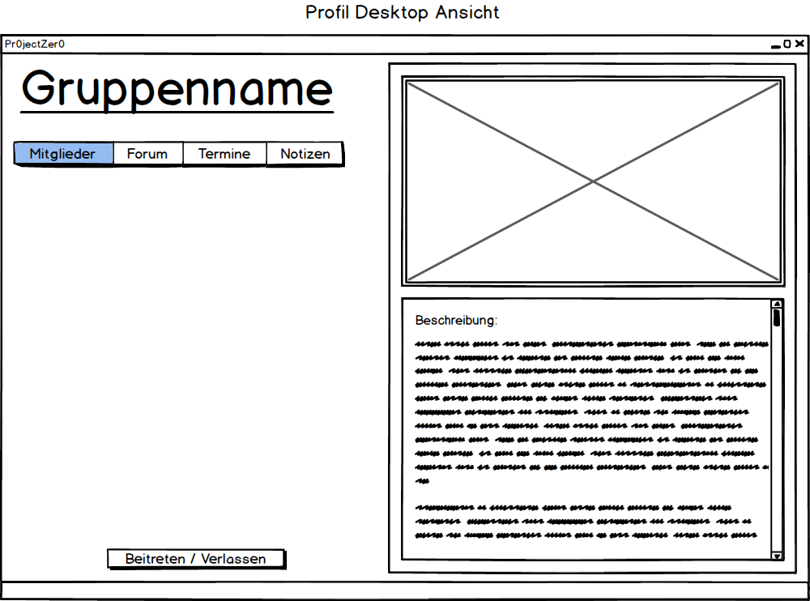
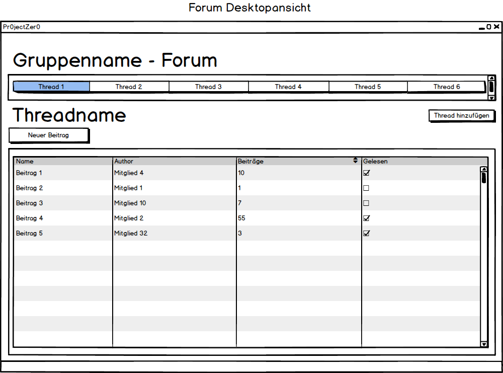
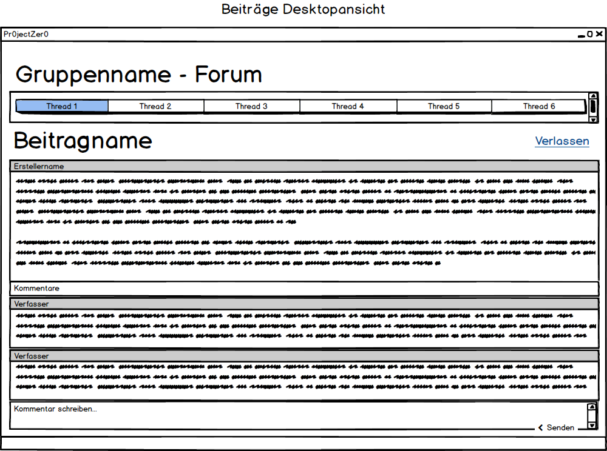
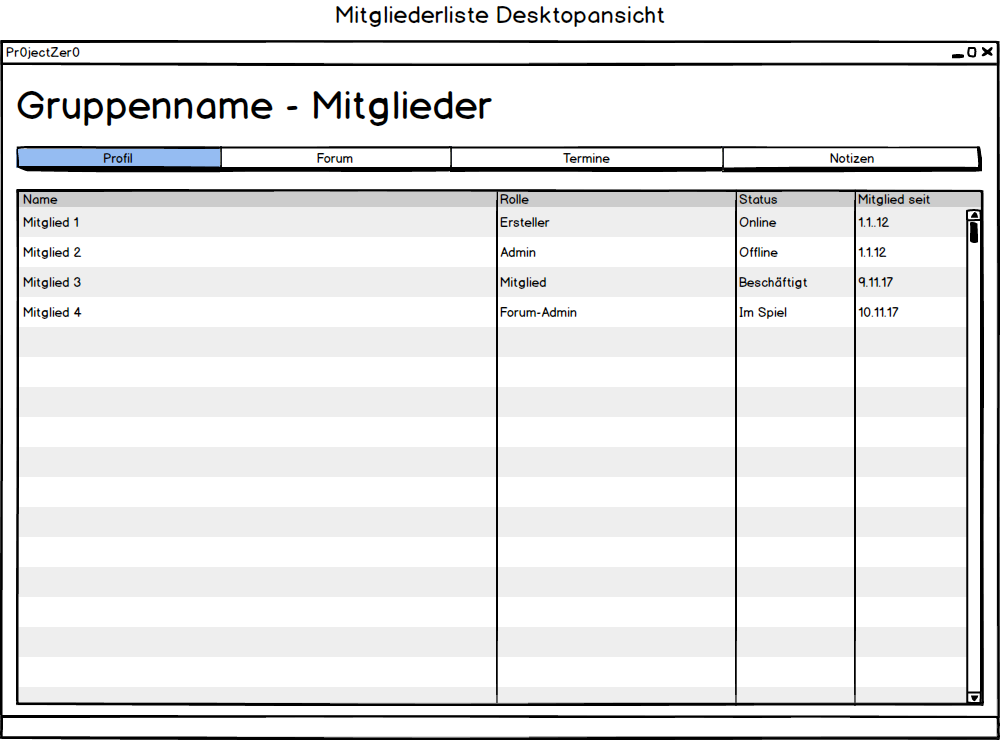
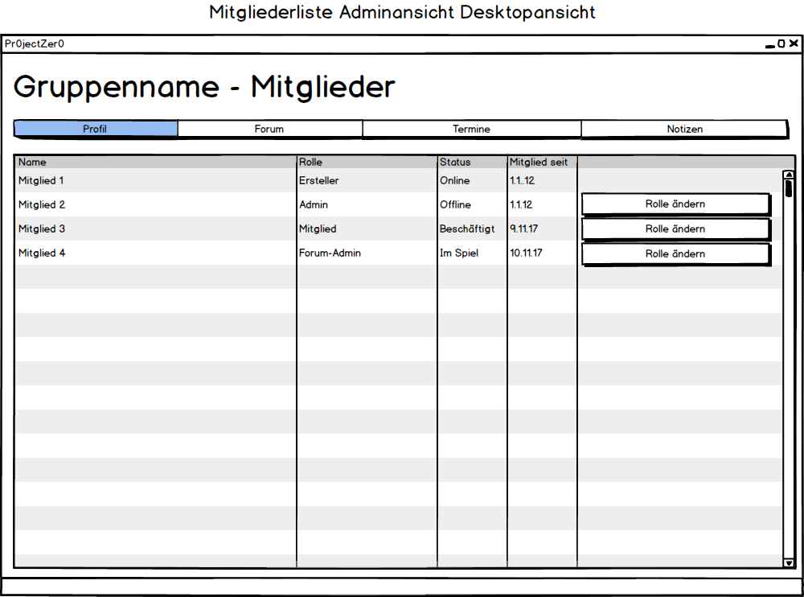

### Chaträume
Es wird zwischen Privatchats, Gruppenchats und öffentliche Chaträumen unterschieden. In den Chaträumen stehen Emojis zur Verfügung. Hyperlinks müssen anklickbar sein. Beim Senden einer Textnachricht wird zuerst der Benutzername und dann mit einem ":" getrennt die Textnachricht angezeigt.
Man kann Privatchats über einen Doppelklick auf den jeweiligen Kontakt öffnen.
Öffentliche Chaträume können erstellt und mit Passwörtern versehen werden. Jeder öffentlicher Chatraum muss einen einzigartigen Namen haben. Es steht eine Liste mit aktiven in den Chat beigetretenen Benutzern zur Verfügung. Über diese Liste können Benutzer zu den Kontakten hinzugefügt werden. Benutzer können Stumm geschaltet werden. 
Über die Gruppenliste kommt man per Doppelklick in den Gruppenchat. Rechts des Gruppenchats wird eine Liste mit den Mitgliedern angezeigt.
Um eine bessere Übersicht in den Notizen zu haben, falls man mehrere Mitarbeiter hat, kann man sich eine Farbe auswählen. Mit dieser Farbe wird der vom Benutzer geschriebene Text hinterlegt. Jede Farbe kann dabei nur von einem Benutzer verwendet werden um Verwechslungen zu vermeiden.
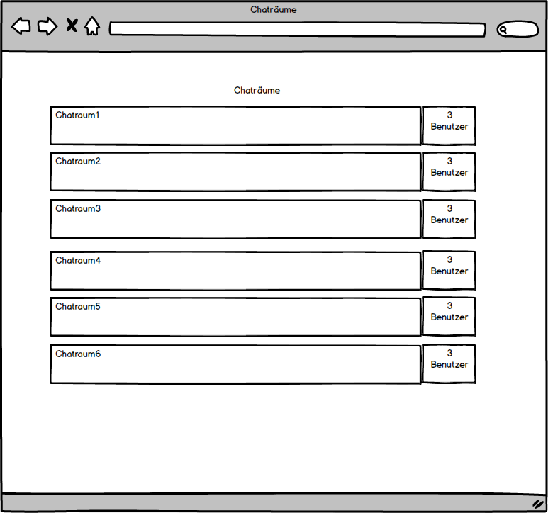
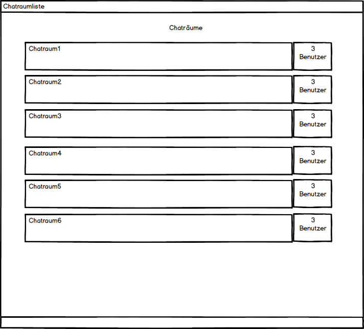

### Freundesliste
Es gibt die Tabs "Freunde" und "Gruppen". In dem Tab "Freunde" werden die Freunde des jeweiligen Benutzers aufgelistet und in dem "Gruppen" Tab die Gruppen. Es können Freunde hinzufügt und gelöscht werden. Diese Freunde werden dann mit einem Status angezeigt. Der Status kann zwischen Online, Offline, Beschäftigt und Abwesend, die jeweils mit einer Farbe makiert sind, variieren. Außerdem bekommt man angezeigt, in welchem Chatraum bzw. Spiel sie sich gerade befinden. Es sind ebenfalls Funktionen zum Öffnen eines Privatchats, Löschen des Freundes, Hinzufügen des Freundes und zum Wechseln des Status vorhanden. Das Anzeigen des derzeitigen Spiels/Chatraums erfolgt automatisch. Es können Gruppen erstellt und gelöscht werden. Man kann Gruppe beitreten und sie verlassen. Andere Kontakte können in Gruppen eingeladen werden.

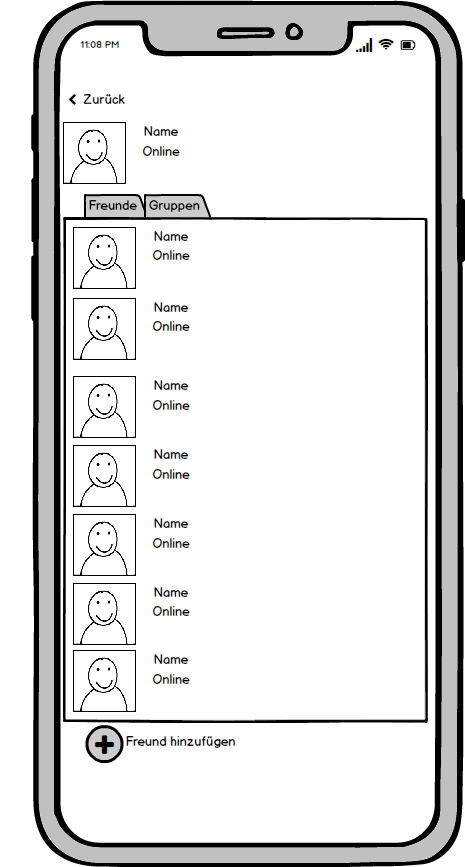

### Terminplaner
Im Terminplaner soll es für den Benutzer möglich seine Termine einzutragen. Diese Termine können für den Benutzer selber sein oder auch für eine ganze Gruppe in der Anwendung. Wenn der Benutzer sich dafür entscheidet ein Termin für eine Gruppe zu planen, können andere für den Termin abstimmen und somit zeigen, dass sie an  dem Tag Zeit haben oder für den Termin absagen. Außerdem wird ein Gruppenmitglied zeitnah benachrichtigt, wenn eine Veranstaltung ansteht. Zur Übersicht werden die Termine in einem Kalender dargestellt, indem man auch an einem bestimmten Tag ein Termin eintragen kann.

### Notizen
Dem Benutzer ist es möglich Notizen anzulegen. Diese kann er außerdem mit anderen Benutzern oder Gruppen teilen. Die Notizen können dadurch angeguckt oder von anderen bearbeitet werden. Der Notizenersteller, kann aber auch festlegen, wer diese Notiz bearbeiten darf. Die Notizen können dann auch den Benutzer oder die Benutzergruppe über festgelegte Zeit benachrichtigen. 
Zur besseren Übersicht der Notiz werden die Beiträge eines Mitgliedes in einer Farbe hinterlegt, welche man über eine Farbauswahl auswählen kann. Jede Farbe kann nur von einem Mitglied benutzt werden um Verwechslung zu vermeiden. 
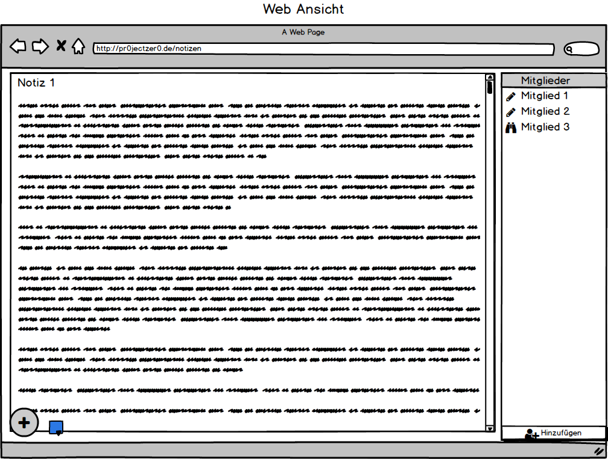 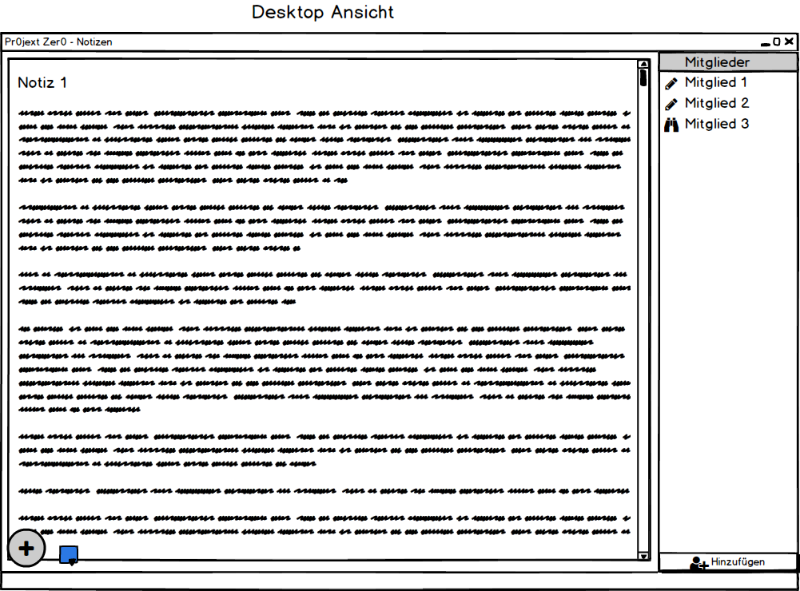 

### Frontend
 **Clientbeschreibungen für ProjectZero**

#### Webclient

**Responsiver Webclient mit PHP, CSS, JavaScript**

| Framework | Sprache 
|:------------ |:--------- |
| Laravel | PHP |
| Bootstrap | CSS |
| Angular 4 | JavaScript |

#### Mobilclient für Android und iOS
**Ionic Framework basierend auf HTML5 und AngularJS**

| Framework | Sprache 
|:------------ |:--------- |
| Ionic | HTML5, AngularJS |

#### Desktop-Client für Windows
**Desktopanwendung geschrieben in C#**

### Backend

#### Server:
Ein Webserver wird für die Backend Applikation benötigt.
Der Server benötigt mindestens diese Anforderungen, da Laravel als Backend für das Projekt benutzt wird.
Larvel ist ein PHP Framework, welches als eine RESTful API Lösung benutzt wird um die Client Anfragen zu verarbeiten und mit der Datenbank kommuniziert.

https://laravel.com/

##### Server Anforderung:

##### System:
* PHP >= 7.0.0	
* OpenSSL PHP Extension
* PDO PHP Extension
* Mbstring PHP Extension
* Tokenizer PHP Extension
* XML PHP Extension

##### Software:
* Nginx oder Appache
* Composer
* Datenbank (MySQL)
* Node
* Git

#### Datenbank:
Die Datenbank kann auch in Laravel aufgebaut werden, dafür können Migrations verwedendet werden.

>Migrations are like version control for your database, allowing your team to easily modify and share the application's database schema. Migrations are 
>typically paired with Laravel's schema builder to easily build your application's database schema. If you have ever had to tell a teammate to manually 
>add a column to their local database schema, you've faced the problem that database migrations solve.

[Quelle](https://laravel.com/docs/5.5/migrations) 

#### Systemarchitekturdiagramm

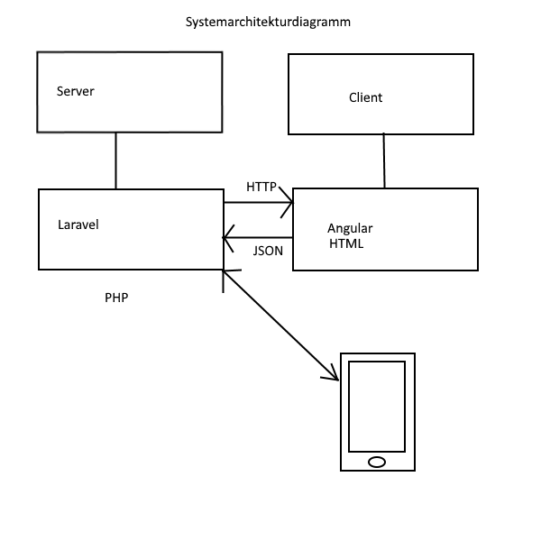

### Optionale Features
* Forum
* Shop
* Blog

**Fehlende Einträge, sowie Rollenverteilung werden hinzugefügt, sobald es zur Entwicklung kommt.**